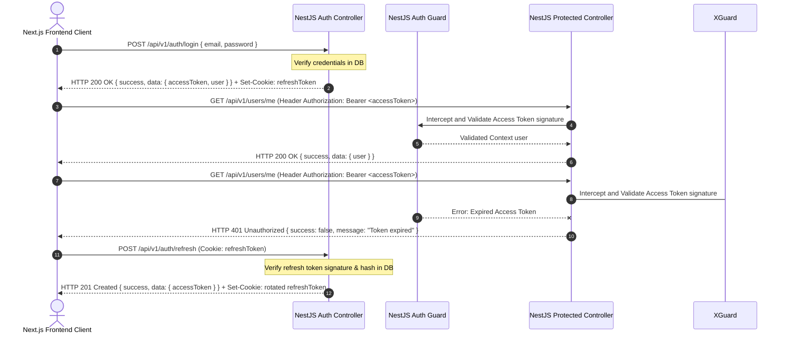

This architecture is governed by:

- [Product Requirements Specification](Product_Requirements_Specification.md)
- [Architecture Principles](Architecture_Principles.md)
- [Engineering Standards](Engineering_Standards.md)
- [System Architecture](System_Architecture.md)
- [Database Design](Database_Design.md)
- [RAG Architecture](RAG_Architecture.md)

These documents collectively define the EnterpriseIQ Version 1 API design.

---

# API Design Document

This document defines the RESTful REST APIs, Server-Sent Events (SSE) streaming specifications, token authentication flows, request/response payload designs, pagination/sorting standards, validation rules, and security controls for **EnterpriseIQ**. It serves as the authoritative blueprint for Version 1 API implementation.

---

## 1. Executive Summary

EnterpriseIQ exposes a standardized RESTful API backend interface to allow communication between Next.js frontend clients and the NestJS backend monolith:

* **REST Architecture**: Clean separation of resources using standard HTTP verbs (`GET`, `POST`, `PATCH`, `DELETE`). Enables stateless request handling, simple routing, caching capabilities, and standardized validation filters.
* **Server-Sent Events (SSE) for Chat Streaming**: Converse workflows (RAG chat completions) generate text tokens incrementally. Standard HTTP REST calls require the client to wait for full answers, leading to high latency. WebSockets introduce bidirectionality and operational tracking constraints. Server-Sent Events (SSE) are selected because they operate over standard HTTP, support native client streaming, handle reconnection automatically, and easily route data chunks, ensuring low perceived latency.

---

## 2. API Design Principles

* **RESTful**: Endpoints are structured around resources (e.g. `/api/v1/documents`) and utilize HTTP verbs to represent CRUD operations.
* **Stateless**: The server does not store client session contexts. Every REST request carries all necessary credentials (JWT) in request headers to execute independently.
* **Versioned**: APIs are version-controlled using a prefix in the URL path (e.g., `/api/v1`) to prevent breaking modifications.
* **Secure by Design**: Enforces token authentication and RBAC validation at the controller entry point using NestJS guards.
* **Consistent Responses**: Success payloads and error messages conform to standardized layouts.
* **DTO Validation**: Controller actions enforce strict input parsing and data sanitization using Data Transfer Objects (DTOs) before executing application layer actions.
* **Resource Oriented**: Path parameters target specific resource IDs (e.g. `/api/v1/users/{id}`).
* **Provider Independent**: Exchanged JSON payloads remain agnostic of down-stream database engines (PostgreSQL, pgvector) or model providers (Google Gemini).
* **Backward Compatibility**: Standardized payload configurations allow schema updates without breaking existing API routes.
* **Simplicity**: Exposes only necessary endpoints to fulfill Version 1 objectives, avoiding premature optimizations.

---

## 3. Global API Standards

### 3.1. Base URL
All API endpoints are prefixed with the following version path:
`/api/v1`

### 3.2. Headers
* `Content-Type`: `application/json` (Required for all JSON REST endpoints)
* `Authorization`: `Bearer <JWT_ACCESS_TOKEN>` (Passed in the request header for protected endpoints)
* `X-Correlation-ID`: `<UUIDv4>` (Correlation ID passed with every request to support request tracing, transaction logging, debugging, and audit compliance investigations across the modular monolith backend)

### 3.3. Response Encoding & Timezones
* **Response Encoding**: UTF-8
* **Timezone**: All dates processed in UTC.
* **Date Format**: ISO-8601 string format (`YYYY-MM-DDTHH:mm:ss.sssZ`).

### 3.4. API Versioning Policy
* **Initial Stable Release**: `/api/v1` acts as the initial stable baseline for EnterpriseIQ.
* **Compatible Enhancements**: Additions that are backward-compatible (e.g., adding new optional query parameters or new JSON fields) will be deployed within the active `/api/v1` prefix.
* **Breaking Changes**: Any modification that breaks existing client assumptions (e.g., renaming paths, deleting fields, changing validation boundaries) requires a new version route, such as `/api/v2`.
* **Deprecation Policy**: Legacy API versions will remain operational for a defined transition period, with deprecation warnings returned in headers before termination.

---

## 4. Authentication Specifications

Access validation uses JSON Web Tokens (JWT) and Refresh Tokens:

* **Access Token**: Short-lived (e.g., 15 minutes) cryptographically signed token passed in the `Authorization: Bearer <token>` header. Contains user ID and role permissions context.
* **Refresh Token**: Long-lived (e.g., 7 days) secure token stored in an HttpOnly, Secure, and SameSite cookie, hashed in the database for rotation verification.
* **Protected Routes**: Backend routes utilize Guards to check signature validity and role scopes.



---

## 5. Standard Response Format

To ensure API clients process responses predictably, all standard REST operations return the following envelope layout:

```json
{
  "success": true,
  "message": "Action completed successfully.",
  "data": {},
  "timestamp": "2026-07-02T03:00:00.000Z"
}
```

* **success**: Boolean flag indicating operation completion.
* **message**: Short textual description of the completed operation.
* **data**: Operation payload (object or array).
* **timestamp**: Server time in UTC.

---

## 6. Standard Error Format

Failed API operations return standard HTTP error status codes and structured payloads containing diagnostic information:

```json
{
  "success": false,
  "statusCode": 400,
  "error": "Bad Request",
  "message": "Validation failed: Email is invalid.",
  "errors": [
    {
      "field": "email",
      "issue": "must be a valid email address"
    }
  ],
  "timestamp": "2026-07-02T03:01:00.000Z"
}
```

### 6.1. Error HTTP Status Codes & Formats

#### 400 Bad Request (Invalid parameters or payloads)
```json
{
  "success": false,
  "statusCode": 400,
  "error": "Bad Request",
  "message": "Invalid query parameters.",
  "timestamp": "2026-07-02T03:01:00.000Z"
}
```

#### 401 Unauthorized (Expired or missing access tokens)
```json
{
  "success": false,
  "statusCode": 401,
  "error": "Unauthorized",
  "message": "Token expired or missing.",
  "timestamp": "2026-07-02T03:01:10.000Z"
}
```

#### 403 Forbidden (Authenticated, but role permission failed)
```json
{
  "success": false,
  "statusCode": 403,
  "error": "Forbidden",
  "message": "Administrator privileges required.",
  "timestamp": "2026-07-02T03:01:20.000Z"
}
```

#### 404 Not Found (Target resource does not exist)
```json
{
  "success": false,
  "statusCode": 404,
  "error": "Not Found",
  "message": "Document with ID 550e8400-e29b-41d4-a716-446655440000 not found.",
  "timestamp": "2026-07-02T03:01:30.000Z"
}
```

#### 409 Conflict (Duplicate file content hash or email registration)
```json
{
  "success": false,
  "statusCode": 409,
  "error": "Conflict",
  "message": "A document with this content hash already exists.",
  "timestamp": "2026-07-02T03:01:40.000Z"
}
```

#### 422 Unprocessable Entity (Semantic or validation schema issues)
```json
{
  "success": false,
  "statusCode": 422,
  "error": "Unprocessable Entity",
  "message": "Unsupported file parsing structure.",
  "timestamp": "2026-07-02T03:01:50.000Z"
}
```

#### 429 Too Many Requests (Rate limit threshold breached)
```json
{
  "success": false,
  "statusCode": 429,
  "error": "Too Many Requests",
  "message": "Rate limit exceeded. Try again in 60 seconds.",
  "timestamp": "2026-07-02T03:02:00.000Z"
}
```

#### 500 Internal Server Error (System failure or downstream service error)
```json
{
  "success": false,
  "statusCode": 500,
  "error": "Internal Server Error",
  "message": "External AI model timeout occurred.",
  "timestamp": "2026-07-02T03:02:10.000Z"
}
```

---

## 7. Endpoint Categories

API interfaces are divided by functional module blocks:

### 7.1. Authentication
* `POST /auth/login` - Authenticate credentials and get access token + refresh cookie.
* `POST /auth/refresh` - Refresh an expired access token using the HTTP-only cookie.
* `POST /auth/logout` - Invalidate the active refresh token and clear cookies.
* `GET /auth/me` - Retrieve profile info for the currently authenticated user.

### 7.2. Users
* `GET /users` - List users.
* `GET /users/{id}` - Retrieve a single user profile.
* `POST /users` - Register a new user profile.
* `PATCH /users/{id}` - Modify user details.
* `DELETE /users/{id}` - Remove a user profile.

### 7.3. Roles
* `GET /roles` - List available RBAC roles.

### 7.4. Documents
* `POST /documents/upload` - Upload a document (PDF, DOCX, TXT) via multipart upload.
* `GET /documents` - List uploaded files with metadata.
* `GET /documents/{id}` - Retrieve details of a specific document.
* `GET /documents/{id}/status` - Retrieve ingestion processing status.
* `DELETE /documents/{id}` - Delete a document and its chunks from storage and pgvector database.

### 7.5. Search
* `POST /search` - Run a semantic search, returning relevant raw text chunks.

### 7.6. Chat
* `POST /chat` - Initiate a RAG chat request (stream tokens via Server-Sent Events).
* `GET /chat/sessions` - List chat sessions for the logged-in user.
* `GET /chat/sessions/{id}` - Retrieve chat message logs for a session.
* `DELETE /chat/sessions/{id}` - Delete a chat session.

### 7.7. Audit
* `GET /audit/logs` - List operational log history records.

### 7.8. Admin
* `GET /admin/dashboard` - Exposes platform stats (file sizes, system latencies).
* `GET /admin/settings` - Exposes active configurations (active model parameters, ingestion flags).
* `PATCH /admin/settings` - Update platform variables.

---

## 8. Endpoint Specification

This section details the request/response layout, query variables, status codes, validations, and permission mappings for each endpoint.

### 8.1. POST /auth/login
* **Purpose**: Authenticates credentials and issues tokens.
* **Authorization**: None (Public).
* **Request Headers**: `Content-Type: application/json`, `X-Correlation-ID: 550e8400-e29b-41d4-a716-446655440000`
* **Request Body**:
  ```json
  {
    "email": "user@enterprise.com",
    "password": "Password123"
  }
  ```
* **Response Body**:
  ```json
  {
    "success": true,
    "message": "Login successful.",
    "data": {
      "accessToken": "eyJhbGciOi...",
      "user": {
        "userId": "550e8400-e29b-41d4-a716-446655440000",
        "email": "user@enterprise.com",
        "roleId": "a90e8400-e29b-41d4-a716-446655440001",
        "departmentId": "b90e8400-e29b-41d4-a716-446655440002"
      }
    },
    "timestamp": "2026-07-02T03:00:00.000Z"
  }
  ```
* **HTTP Status Codes**: `200 OK`, `400 Bad Request`, `401 Unauthorized`
* **Validation Rules**: Email format checking, non-empty password field.

### 8.2. POST /auth/refresh
* **Purpose**: Generates a new access token.
* **Authorization**: Refresh cookie validated by auth guards.
* **Request Headers**: `X-Correlation-ID: 550e8400-e29b-41d4-a716-446655440000`
* **Request Body**: None (Validates `refreshToken` from secure cookie context).
* **Response Body**:
  ```json
  {
    "success": true,
    "message": "Token refreshed.",
    "data": {
      "accessToken": "eyJhbGciOi..."
    },
    "timestamp": "2026-07-02T03:00:15.000Z"
  }
  ```
* **HTTP Status Codes**: `200 OK`, `401 Unauthorized`
* **Validation Rules**: Hashed comparison matches database records.

### 8.3. POST /auth/logout
* **Purpose**: Invalidates refresh tokens.
* **Authorization**: Require authenticated JWT.
* **Request Headers**: `Authorization: Bearer <accessToken>`, `X-Correlation-ID: 550e8400-e29b-41d4-a716-446655440000`
* **Request Body**: None.
* **Response Body**:
  ```json
  {
    "success": true,
    "message": "Logout successful.",
    "data": {},
    "timestamp": "2026-07-02T03:00:20.000Z"
  }
  ```
* **HTTP Status Codes**: `200 OK`, `401 Unauthorized`

### 8.4. GET /auth/me
* **Purpose**: Retrieves profile details.
* **Authorization**: Require authenticated JWT.
* **Request Headers**: `Authorization: Bearer <accessToken>`, `X-Correlation-ID: 550e8400-e29b-41d4-a716-446655440000`
* **Request Body**: None.
* **Response Body**:
  ```json
  {
    "success": true,
    "message": "Profile retrieved.",
    "data": {
      "userId": "550e8400-e29b-41d4-a716-446655440000",
      "email": "user@enterprise.com",
      "firstName": "John",
      "lastName": "Doe",
      "roleId": "a90e8400-e29b-41d4-a716-446655440001",
      "departmentId": "b90e8400-e29b-41d4-a716-446655440002"
    },
    "timestamp": "2026-07-02T03:00:30.000Z"
  }
  ```
* **HTTP Status Codes**: `200 OK`, `401 Unauthorized`

### 8.5. GET /users
* **Purpose**: Lists user profiles.
* **Authorization**: RBAC Role validation (requires `Administrator`).
* **Request Headers**: `Authorization: Bearer <accessToken>`, `X-Correlation-ID: 550e8400-e29b-41d4-a716-446655440000`
* **Query Parameters**: `page`, `limit`, `sort`, `order` (for pagination), `departmentId` (filter).
* **Response Body**:
  ```json
  {
    "success": true,
    "message": "Users list retrieved.",
    "data": {
      "users": [
        {
          "userId": "550e8400-e29b-41d4-a716-446655440000",
          "email": "user@enterprise.com",
          "firstName": "John",
          "lastName": "Doe",
          "roleId": "a90e8400-e29b-41d4-a716-446655440001",
          "departmentId": "b90e8400-e29b-41d4-a716-446655440002",
          "createdAt": "2026-07-02T03:00:00.000Z",
          "updatedAt": "2026-07-02T03:00:00.000Z"
        }
      ],
      "pagination": {
        "page": 1,
        "limit": 10,
        "totalCount": 15
      }
    },
    "timestamp": "2026-07-02T03:00:40.000Z"
  }
  ```
* **HTTP Status Codes**: `200 OK`, `401 Unauthorized`, `403 Forbidden`

### 8.6. GET /users/{id}
* **Purpose**: Retrieves a specific user profile.
* **Authorization**: RBAC Role validation (requires `Administrator`).
* **Request Headers**: `Authorization: Bearer <accessToken>`, `X-Correlation-ID: 550e8400-e29b-41d4-a716-446655440000`
* **Path Parameters**: `id` (UUID format - e.g. `550e8400-e29b-41d4-a716-446655440000`).
* **Response Body**:
  ```json
  {
    "success": true,
    "message": "User details retrieved.",
    "data": {
      "userId": "550e8400-e29b-41d4-a716-446655440000",
      "email": "user@enterprise.com",
      "firstName": "John",
      "lastName": "Doe",
      "roleId": "a90e8400-e29b-41d4-a716-446655440001",
      "departmentId": "b90e8400-e29b-41d4-a716-446655440002",
      "createdAt": "2026-07-02T03:00:00.000Z",
      "updatedAt": "2026-07-02T03:00:00.000Z"
    },
    "timestamp": "2026-07-02T03:00:50.000Z"
  }
  ```
* **HTTP Status Codes**: `200 OK`, `401 Unauthorized`, `403 Forbidden`, `404 Not Found`

### 8.7. POST /users
* **Purpose**: Registers a new user account.
* **Authorization**: RBAC Role validation (requires `Administrator`).
* **Request Headers**: `Authorization: Bearer <accessToken>`, `Content-Type: application/json`, `X-Correlation-ID: 550e8400-e29b-41d4-a716-446655440000`
* **Request Body**:
  ```json
  {
    "email": "newuser@enterprise.com",
    "password": "TempPassword123!",
    "firstName": "Jane",
    "lastName": "Smith",
    "roleId": "a90e8400-e29b-41d4-a716-446655440001",
    "departmentId": "b90e8400-e29b-41d4-a716-446655440002"
  }
  ```
* **Response Body**:
  ```json
  {
    "success": true,
    "message": "User created successfully.",
    "data": {
      "userId": "550e8400-e29b-41d4-a716-446655440000"
    },
    "timestamp": "2026-07-02T03:01:00.000Z"
  }
  ```
* **HTTP Status Codes**: `201 Created`, `400 Bad Request`, `401 Unauthorized`, `403 Forbidden`, `409 Conflict`
* **Validation Rules**: DTO verification ensures password meets complexity requirements, and values point to active Roles and Departments.

### 8.8. PATCH /users/{id}
* **Purpose**: Modifies details of a specific user.
* **Authorization**: RBAC Role validation (requires `Administrator`).
* **Request Headers**: `Authorization: Bearer <accessToken>`, `Content-Type: application/json`, `X-Correlation-ID: 550e8400-e29b-41d4-a716-446655440000`
* **Path Parameters**: `id` (UUID format - e.g. `550e8400-e29b-41d4-a716-446655440000`).
* **Request Body**:
  ```json
  {
    "firstName": "Jane",
    "roleId": "a90e8400-e29b-41d4-a716-446655440001"
  }
  ```
* **Response Body**:
  ```json
  {
    "success": true,
    "message": "User updated successfully.",
    "data": {
      "userId": "550e8400-e29b-41d4-a716-446655440000"
    },
    "timestamp": "2026-07-02T03:01:10.000Z"
  }
  ```
* **HTTP Status Codes**: `200 OK`, `400 Bad Request`, `401 Unauthorized`, `403 Forbidden`, `404 Not Found`

### 8.9. DELETE /users/{id}
* **Purpose**: Removes a user profile.
* **Authorization**: RBAC Role validation (requires `Administrator`).
* **Request Headers**: `Authorization: Bearer <accessToken>`, `X-Correlation-ID: 550e8400-e29b-41d4-a716-446655440000`
* **Path Parameters**: `id` (UUID format - e.g. `550e8400-e29b-41d4-a716-446655440000`).
* **Response Body**:
  ```json
  {
    "success": true,
    "message": "User deleted successfully.",
    "data": {},
    "timestamp": "2026-07-02T03:01:20.000Z"
  }
  ```
* **HTTP Status Codes**: `200 OK`, `401 Unauthorized`, `403 Forbidden`, `404 Not Found`

### 8.10. GET /roles
* **Purpose**: Lists available RBAC roles.
* **Authorization**: Require authenticated JWT.
* **Request Headers**: `Authorization: Bearer <accessToken>`, `X-Correlation-ID: 550e8400-e29b-41d4-a716-446655440000`
* **Response Body**:
  ```json
  {
    "success": true,
    "message": "Roles list retrieved.",
    "data": [
      {
        "roleId": "a90e8400-e29b-41d4-a716-446655440001",
        "name": "Administrator",
        "description": "IT/SecOps admin"
      }
    ],
    "timestamp": "2026-07-02T03:01:30.000Z"
  }
  ```
* **HTTP Status Codes**: `200 OK`, `401 Unauthorized`

### 8.11. POST /documents/upload
* **Purpose**: Uploads and registers documents.
* **Authorization**: RBAC Role validation (requires `Administrator` or `Manager / Team Lead`).
* **Request Headers**: `Authorization: Bearer <accessToken>`, `Content-Type: multipart/form-data`, `X-Correlation-ID: 550e8400-e29b-41d4-a716-446655440000`
* **Request Body**: Form parameters:
  - `file`: Binary file stream (PDF, DOCX, TXT format, <50MB size).
  - `departmentId`: UUID target boundary (e.g. `b90e8400-e29b-41d4-a716-446655440002`).
  - `tags`: Optional comma-separated strings.
* **Response Body**:
  ```json
  {
    "success": true,
    "message": "File uploaded, ingestion parsing started.",
    "data": {
      "documentId": "c90e8400-e29b-41d4-a716-446655440003",
      "filename": "remote_work.pdf",
      "status": "Pending",
      "contentHash": "sha-256-hash-value"
    },
    "timestamp": "2026-07-02T03:01:40.000Z"
  }
  ```
* **HTTP Status Codes**: `201 Created`, `400 Bad Request`, `401 Unauthorized`, `403 Forbidden`, `409 Conflict`

### 8.12. GET /documents
* **Purpose**: Lists registered documents.
* **Authorization**: Require authenticated JWT.
* **Request Headers**: `Authorization: Bearer <accessToken>`, `X-Correlation-ID: 550e8400-e29b-41d4-a716-446655440000`
* **Query Parameters**: `page`, `limit`, `sort`, `order` (for pagination), `departmentId` (filter).
* **Response Body**:
  ```json
  {
    "success": true,
    "message": "Documents catalog retrieved.",
    "data": {
      "documents": [
        {
          "documentId": "c90e8400-e29b-41d4-a716-446655440003",
          "filename": "remote_work.pdf",
          "createdAt": "2026-07-02T03:01:40.000Z",
          "status": "Completed"
        }
      ],
      "pagination": {
        "page": 1,
        "limit": 20,
        "totalCount": 1
      }
    },
    "timestamp": "2026-07-02T03:01:50.000Z"
  }
  ```
* **HTTP Status Codes**: `200 OK`, `401 Unauthorized`

### 8.13. GET /documents/{id}
* **Purpose**: Retrieves details of a specific document.
* **Authorization**: Require authenticated JWT.
* **Request Headers**: `Authorization: Bearer <accessToken>`, `X-Correlation-ID: 550e8400-e29b-41d4-a716-446655440000`
* **Path Parameters**: `id` (UUID format - e.g. `c90e8400-e29b-41d4-a716-446655440003`).
* **Response Body**:
  ```json
  {
    "success": true,
    "message": "Document metadata retrieved.",
    "data": {
      "documentId": "c90e8400-e29b-41d4-a716-446655440003",
      "filename": "remote_work.pdf",
      "status": "Completed",
      "fileSize": 1024500,
      "uploadedById": "550e8400-e29b-41d4-a716-446655440000",
      "departmentId": "b90e8400-e29b-41d4-a716-446655440002"
    },
    "timestamp": "2026-07-02T03:02:00.000Z"
  }
  ```
* **HTTP Status Codes**: `200 OK`, `401 Unauthorized`, `404 Not Found`

### 8.14. GET /documents/{id}/status
* **Purpose**: Retrieves document ingestion processing status.
* **Authorization**: Require authenticated JWT.
* **Request Headers**: `Authorization: Bearer <accessToken>`, `X-Correlation-ID: 550e8400-e29b-41d4-a716-446655440000`
* **Path Parameters**: `id` (UUID format - e.g. `c90e8400-e29b-41d4-a716-446655440003`).
* **Response Body**:
  ```json
  {
    "success": true,
    "message": "Document status checked.",
    "data": {
      "documentId": "c90e8400-e29b-41d4-a716-446655440003",
      "status": "Processing"
    },
    "timestamp": "2026-07-02T03:02:10.000Z"
  }
  ```
* **HTTP Status Codes**: `200 OK`, `401 Unauthorized`, `404 Not Found`

### 8.15. DELETE /documents/{id}
* **Purpose**: Removes a document.
* **Authorization**: RBAC Role validation (requires `Administrator` or `Manager / Team Lead`).
* **Request Headers**: `Authorization: Bearer <accessToken>`, `X-Correlation-ID: 550e8400-e29b-41d4-a716-446655440000`
* **Path Parameters**: `id` (UUID format - e.g. `c90e8400-e29b-41d4-a716-446655440003`).
* **Response Body**:
  ```json
  {
    "success": true,
    "message": "Document and chunks successfully deleted.",
    "data": {},
    "timestamp": "2026-07-02T03:02:20.000Z"
  }
  ```
* **HTTP Status Codes**: `200 OK`, `401 Unauthorized`, `403 Forbidden`, `404 Not Found`

### 8.16. POST /search
* **Purpose**: Performs a semantic search.
* **Authorization**: Require authenticated JWT.
* **Request Headers**: `Authorization: Bearer <accessToken>`, `Content-Type: application/json`, `X-Correlation-ID: 550e8400-e29b-41d4-a716-446655440000`
* **Request Body**:
  ```json
  {
    "query": "remote work stipend policy",
    "limit": 5
  }
  ```
* **Response Body**:
  ```json
  {
    "success": true,
    "message": "Similarity query completed.",
    "data": {
      "results": [
        {
          "chunkId": "190e8400-e29b-41d4-a716-446655440008",
          "documentId": "c90e8400-e29b-41d4-a716-446655440003",
          "filename": "remote_work.pdf",
          "content": "Employees working from home are entitled to a stipend of $50 per month...",
          "similarityScore": 0.892,
          "pageNumber": 3
        }
      ]
    },
    "timestamp": "2026-07-02T03:02:30.000Z"
  }
  ```
* **HTTP Status Codes**: `200 OK`, `400 Bad Request`, `401 Unauthorized`

### 8.17. POST /chat
* **Purpose**: Initiates RAG chat (streams response).
* **Authorization**: Require authenticated JWT.
* **Request Headers**: `Authorization: Bearer <accessToken>`, `Content-Type: application/json`, `Accept: text/event-stream`, `X-Correlation-ID: 550e8400-e29b-41d4-a716-446655440000`
* **Request Body**:
  ```json
  {
    "chatSessionId": "d90e8400-e29b-41d4-a716-446655440004",
    "message": "What is the internet stipend amount?"
  }
  ```
* **Response Body**: Standard Server-Sent Events stream (see Section 10).
* **HTTP Status Codes**: `200 OK`, `400 Bad Request`, `401 Unauthorized`

### 8.18. GET /chat/sessions
* **Purpose**: Lists chat sessions for the active user.
* **Authorization**: Require authenticated JWT.
* **Request Headers**: `Authorization: Bearer <accessToken>`, `X-Correlation-ID: 550e8400-e29b-41d4-a716-446655440000`
* **Response Body**:
  ```json
  {
    "success": true,
    "message": "Chat sessions retrieved.",
    "data": [
      {
        "chatSessionId": "d90e8400-e29b-41d4-a716-446655440004",
        "title": "Stipend Inquiry",
        "createdAt": "2026-07-02T03:00:00.000Z"
      }
    ],
    "timestamp": "2026-07-02T03:02:40.000Z"
  }
  ```
* **HTTP Status Codes**: `200 OK`, `401 Unauthorized`

### 8.19. GET /chat/sessions/{id}
* **Purpose**: Retrieves message history logs.
* **Authorization**: Require authenticated JWT.
* **Request Headers**: `Authorization: Bearer <accessToken>`, `X-Correlation-ID: 550e8400-e29b-41d4-a716-446655440000`
* **Path Parameters**: `id` (UUID format - e.g. `d90e8400-e29b-41d4-a716-446655440004`).
* **Response Body**:
  ```json
  {
    "success": true,
    "message": "Chat messages history retrieved.",
    "data": [
      {
        "id": "e90e8400-e29b-41d4-a716-446655440005",
        "role": "User",
        "content": "What is the internet stipend amount?",
        "createdAt": "2026-07-02T03:01:00.000Z"
      },
      {
        "id": "e90e8400-e29b-41d4-a716-446655440006",
        "role": "Assistant",
        "content": "The internet stipend amount is $50 per month.",
        "citations": [
          {
            "documentId": "c90e8400-e29b-41d4-a716-446655440003",
            "filename": "remote_work.pdf",
            "page": 3
          }
        ],
        "createdAt": "2026-07-02T03:01:02.000Z"
      }
    ],
    "timestamp": "2026-07-02T03:02:50.000Z"
  }
  ```
* **HTTP Status Codes**: `200 OK`, `401 Unauthorized`, `404 Not Found`

### 8.20. DELETE /chat/sessions/{id}
* **Purpose**: Deletes a chat session.
* **Authorization**: Require authenticated JWT.
* **Request Headers**: `Authorization: Bearer <accessToken>`, `X-Correlation-ID: 550e8400-e29b-41d4-a716-446655440000`
* **Path Parameters**: `id` (UUID format - e.g. `d90e8400-e29b-41d4-a716-446655440004`).
* **Response Body**:
  ```json
  {
    "success": true,
    "message": "Chat session and messages successfully deleted.",
    "data": {},
    "timestamp": "2026-07-02T03:03:00.000Z"
  }
  ```
* **HTTP Status Codes**: `200 OK`, `401 Unauthorized`, `404 Not Found`

### 8.21. GET /audit/logs
* **Purpose**: Lists audit logs.
* **Authorization**: RBAC Role validation (requires `Administrator`).
* **Request Headers**: `Authorization: Bearer <accessToken>`, `X-Correlation-ID: 550e8400-e29b-41d4-a716-446655440000`
* **Query Parameters**: `page`, `limit`, `startDate`, `endDate`, `userId`, `action`.
* **Response Body**:
  ```json
  {
    "success": true,
    "message": "Audit logs retrieved.",
    "data": {
      "logs": [
        {
          "id": "f90e8400-e29b-41d4-a716-446655440007",
          "userId": "550e8400-e29b-41d4-a716-446655440000",
          "action": "Search",
          "createdAt": "2026-07-02T03:02:30.000Z",
          "ipAddress": "192.168.1.50"
        }
      ],
      "pagination": {
        "page": 1,
        "limit": 50,
        "totalCount": 100
      }
    },
    "timestamp": "2026-07-02T03:03:10.000Z"
  }
  ```
* **HTTP Status Codes**: `200 OK`, `401 Unauthorized`, `403 Forbidden`

### 8.22. GET /admin/dashboard
* **Purpose**: Exposes dashboard stats.
* **Authorization**: RBAC Role validation (requires `Administrator`).
* **Request Headers**: `Authorization: Bearer <accessToken>`, `X-Correlation-ID: 550e8400-e29b-41d4-a716-446655440000`
* **Response Body**:
  ```json
  {
    "success": true,
    "message": "Admin metrics dashboard retrieved.",
    "data": {
      "totalDocuments": 150,
      "totalChunks": 8500,
      "totalUsers": 25,
      "storageUsedBytes": 104857600
    },
    "timestamp": "2026-07-02T03:03:20.000Z"
  }
  ```
* **HTTP Status Codes**: `200 OK`, `401 Unauthorized`, `403 Forbidden`

### 8.23. GET /admin/settings
* **Purpose**: Retrieves configuration settings.
* **Authorization**: RBAC Role validation (requires `Administrator`).
* **Request Headers**: `Authorization: Bearer <accessToken>`, `X-Correlation-ID: 550e8400-e29b-41d4-a716-446655440000`
* **Response Body**:
  ```json
  {
    "success": true,
    "message": "System configurations retrieved.",
    "data": {
      "maxUploadSizeMb": 50,
      "chunkSize": 500,
      "chunkOverlap": 50,
      "activeModel": "configured-ai-model"
    },
    "timestamp": "2026-07-02T03:03:30.000Z"
  }
  ```
* **HTTP Status Codes**: `200 OK`, `401 Unauthorized`, `403 Forbidden`

### 8.24. PATCH /admin/settings
* **Purpose**: Updates platform configurations.
* **Authorization**: RBAC Role validation (requires `Administrator`).
* **Request Headers**: `Authorization: Bearer <accessToken>`, `Content-Type: application/json`, `X-Correlation-ID: 550e8400-e29b-41d4-a716-446655440000`
* **Request Body**:
  ```json
  {
    "maxUploadSizeMb": 60,
    "chunkSize": 600
  }
  ```
* **Response Body**:
  ```json
  {
    "success": true,
    "message": "Configurations updated successfully.",
    "data": {},
    "timestamp": "2026-07-02T03:03:40.000Z"
  }
  ```
* **HTTP Status Codes**: `200 OK`, `400 Bad Request`, `401 Unauthorized`, `403 Forbidden`

---

## 9. File Ingestion & Idempotency

The platform supports manual file uploads via the `POST /documents/upload` endpoint.

* **Multipart Upload**: The API uses the standard `multipart/form-data` encoding format to handle binary file streams.
* **Supported Formats**: 
  - Portable Document Format (`.pdf`, MIME type `application/pdf`)
  - Word Documents (`.docx`, MIME type `application/vnd.openxmlformats-officedocument.wordprocessingml.document`)
  - Plain Text Files (`.txt`, MIME type `text/plain`)
* **Maximum File Size**: strictly capped at 50MB. Requests exceeding this threshold are immediately rejected with an HTTP 400 Bad Request error at the controller layer.
* **API Idempotency & Duplicate Detection**:
  - The file ingestion pipeline is idempotent.
  - Duplicate detection is performed using a SHA-256 content hash computed from the uploaded file stream.
  - If a file with an identical hash is uploaded again, the system rejects the operation and does not re-parse, split, or generate duplicate embeddings.
  - The request returns an HTTP `409 Conflict` error indicating that the document already exists in the workspace.
* **Validation**:
  - MIME-type validation verifies file magic headers (preventing executable code execution or file extension spoofing).
  - Validation ensures all target permissions (`roleId` and `departmentId`) point to existing database records.

---

## 10. Chat Streaming API

The `POST /chat` endpoint streams conversational completions token-by-token using **Server-Sent Events (SSE)**.

* **Accept Header**: The client must request SSE by setting the `Accept: text/event-stream` header.
* **Streaming Flow**: The backend establishes a persistent connection and streams data chunks using standard SSE syntax (`event: <type>\ndata: <json>\n\n`).
* **Event Types**:
  - `message`: Streams generated text completion tokens as they are returned from the Active AI Provider.
    ```json
    { "token": "stipend" }
    ```
  - `citation`: Dispatches mapped chunk metadata reference nodes once source grounding is verified.
    ```json
    { "documentId": "c90e8400-e29b-41d4-a716-446655440003", "filename": "remote_work.pdf", "page": 3 }
    ```
  - `complete`: Signifies the finalization of LLM generations.
    ```json
    { "chatSessionId": "d90e8400-e29b-41d4-a716-446655440004" }
    ```
  - `error`: Transmits connection or parsing errors before terminating.
    ```json
    { "code": "API_TIMEOUT", "message": "External AI model timeout occurred." }
    ```

---

## 11. Pagination Standards

All GET listing routes that return lists of records use standard pagination parameters to protect performance:

```
GET /api/v1/documents?page=1&limit=20&sort=uploadDate&order=desc
```

* **page**: Page offset index (1-based, default: 1).
* **limit**: Number of items per page (default: 20, max limit: 100).
* **sort**: Field name to sort results by (e.g. `uploadDate`, `email`, `createdAt`).
* **order**: Ordering direction (`asc` or `desc`).
* **Metadata Envelope**: paginated lists include a pagination metadata object inside the standard response envelope:
  ```json
  "pagination": {
    "page": 1,
    "limit": 20,
    "totalCount": 120
  }
  ```

---

## 12. Filtering & Searching Standards

Query parameters are structured to allow precise filtering:

* **Department Filters**: Filters records to match a department UUID (e.g., `?departmentId=b90e8400-e29b-41d4-a716-446655440002`).
* **Status Flags**: Filters records by status (e.g., `?status=Completed`).
* **Date Filters**: Filters records using date ranges (e.g., `?startDate=2026-07-01T00:00:00Z&endDate=2026-07-02T23:59:59Z`).
* **Logical Joins**: Filters are applied to database operations via Prisma, preventing loading raw table rows into application memory.

---

## 13. Input Validation

The system enforces input validation at the entry boundaries:

* **DTO Validation**: Controller input models use class-validator decorators, executing validation before the payload reaches business services.
* **Input Sanitization**: Strings are processed to remove dangerous markup strings, preventing HTML and script injections.
* **File Validation**: Validates file types by inspecting file binary signatures rather than relying solely on file extensions.

---

## 14. API Security

* **JWT & Refresh Tokens**: Employs stateless token pairs, combining access tokens in request headers with rotate-and-revoke refresh tokens in HTTP-only, secure cookies.
* **RBAC Route Guards**: REST endpoints are annotated with role permissions. NestJS guards verify the user's role (Administrator, Manager, Employee) against route configurations.
* **Rate Limiting**: Throttles request rates at the API gateway layer to prevent denial-of-service and credential stuffing attacks.
* **CORS**: Configures allowed origins, headers, and request methods, preventing unauthorized browser scripting attacks.
* **SQL Injection**: Prisma parameterizes queries, protecting database operations from SQL injection vulnerabilities.
* **XSS Prevention**: Response filters ensure characters are escaped appropriately before returning text to client browsers.
* **File Upload Security**: Restricts upload sizes, validates MIME types, and stores uploaded files outside the public directory.
* **Security Headers**: Standard secure HTTP headers configured at the backend monolith layer:
  - **Helmet**: Disables vulnerability-prone default headers and sets strict security configurations.
  - **Content-Security-Policy (CSP)**: Context borders restricting source script origins, mitigating cross-site scripting (XSS) and code injection exploits.
  - **X-Frame-Options**: Mitigates clickjacking attacks by blocking frame embeds (`DENY` or `SAMEORIGIN`).
  - **X-Content-Type-Options**: Blocks browser MIME type sniffing, forcing execution to align strictly with the declared content-type (`nosniff`).
  - **Referrer-Policy**: Limits the disclosure of referrer details in outbound headers (`no-referrer` or `strict-origin-when-cross-origin`).

---

## 15. OpenAPI Documentation

* **Swagger/OpenAPI**: The backend exposes Swagger documentation at `/api/docs`.
* **API Discoverability**: Endpoint routes, DTOs, query parameters, status codes, and error models are automatically mapped using NestJS Swagger integration, ensuring that frontend developers always have access to up-to-date documentation.

---

## 16. Future API Evolution

The API structure is designed to support future additions without breaking backward compatibility:

* **Voice APIs**: Can be introduced as a new category (e.g., `/api/v1/voice/transcribe`), routing outputs to the existing chat completion pipeline.
* **Connectors**: Sync scheduling and setup endpoints can be added under `/api/v1/connectors` without changing document schemas.
* **OCR**: File upload endpoints can support image files (e.g., `.png`, `.jpg`) by routing them to an OCR parser behind the same `POST /documents/upload` route.
* **Hybrid Search**: The `/api/v1/search` endpoint can accept an optional query parameter `?type=hybrid` to support keyword queries alongside semantic search.
* **Additional AI Providers**: The system configuration settings endpoint (`PATCH /admin/settings`) can support changing provider keys.
* **SSO**: Identity provider redirect endpoints can be added under `/api/v1/auth/sso`.
* **Multi-tenancy**: Adding multi-tenancy involves injecting a tenant identifier context into routes using headers (e.g. `X-Workspace-ID`), mapping parameters to tenant-specific tables.

---

## 17. API Architectural Decisions (ADRs)

### ADR-001: REST Architecture
* **Decision**: Expose system capabilities using a RESTful API framework.
* **Reason**: Highly readable, standard caching support, and excellent integration with web clients.
* **Trade-off**: Higher latency for sequential operations, mitigated using SSE for chat streaming.

### ADR-002: JWT Access Tokens
* **Decision**: Implement stateless JWT Access Tokens for request authentication.
* **Reason**: Eliminates the need to retrieve session details from a database on every API request.
* **Trade-off**: Revocation during active session windows requires checking blacklist tables.

### ADR-003: Refresh Tokens
* **Decision**: Implement Refresh Tokens stored in HTTP-only, secure, and SameSite cookies.
* **Reason**: Enables session renewal without storing access tokens persistently in frontend state files.
* **Trade-off**: Requires database tables to track token status.

### ADR-004: Server-Sent Events (SSE)
* **Decision**: Stream RAG responses using Server-Sent Events (SSE).
* **Reason**: Operates over standard HTTP protocols, provides built-in reconnection capabilities, and avoids the complexity of WebSockets.
* **Trade-off**: Unidirectional communication, which is appropriate for RAG chat output streaming.

### ADR-005: Auto-generated OpenAPI Specifications
* **Decision**: Generate OpenAPI documentation automatically using NestJS Swagger module.
* **Reason**: Ensures documentation stays in sync with code modifications.
* **Trade-off**: Developer must define input DTO formats, but this is a best practice.

### ADR-006: Class-validator DTO Validation
* **Decision**: Validate inputs at controller boundaries using class-validator.
* **Reason**: Prevents bad data from reaching business services, keeping services clean.
* **Trade-off**: Requires writing validation files for all request bodies.

### ADR-007: Versioned APIs
* **Decision**: Prefix all routes with `/api/v1`.
* **Reason**: Protects against system breaks when releasing updates.
* **Trade-off**: Slightly longer URL paths.

### ADR-008: Resource-Oriented URL Design
* **Decision**: Define API paths using resource nouns (e.g. `/users/{id}`).
* **Reason**: Standardizes path naming conventions, making the API easy to learn.
* **Trade-off**: Requires mapping operations to REST resources.

---

Document Status

Version: 1.0

Status: BASELINE APPROVED

Approved By

- Product Owner
- Software Architect

Related Documents

- [Product Requirements Specification](Product_Requirements_Specification.md)
- [Architecture Principles](Architecture_Principles.md)
- [Engineering Standards](Engineering_Standards.md)
- [System Architecture](System_Architecture.md)
- [Database Design](Database_Design.md)
- [RAG Architecture](RAG_Architecture.md)

-------------------------------------------------

## API Design Review Summary

✔ **Improvements Applied**: 
  - Standardized all UUID structures to follow valid RFC-4122 specifications (e.g., `550e8400-e29b-41d4-a716-446655440000`).
  - Removed all hardcoded AI model tags (e.g., `gemini-1.5-pro`) and replaced them with provider-independent identifiers (`Configured AI Model`, `Active AI Provider`, etc.).
  - Configured transaction mapping log parameters to leverage correlation tracing headers (`X-Correlation-ID`).
  - Added dedicated subsections documenting file upload idempotency policies (SHA-256 hash checks and `409 Conflict` behaviors) and backend middleware security headers (`Helmet`, `CSP`, `X-Frame-Options`, `X-Content-Type-Options`, `Referrer-Policy`).
  
✔ **Consistency Issues Fixed**:
  - Unified all relational keys and date attributes under `camelCase` constraints (`userId`, `roleId`, `departmentId`, `documentId`, `chatSessionId`, `createdAt`, `updatedAt`) consistently across all payload templates, queries, and descriptions.
  - Aligned all path params and error envelopes to use clean JSON syntax.
  
✔ **Remaining Recommendations**: None. The REST endpoint layouts and authorization scopes are fully aligned with modular monolith specs.

**API_Design.md is considered BASELINE FROZEN and ready for implementation.**
