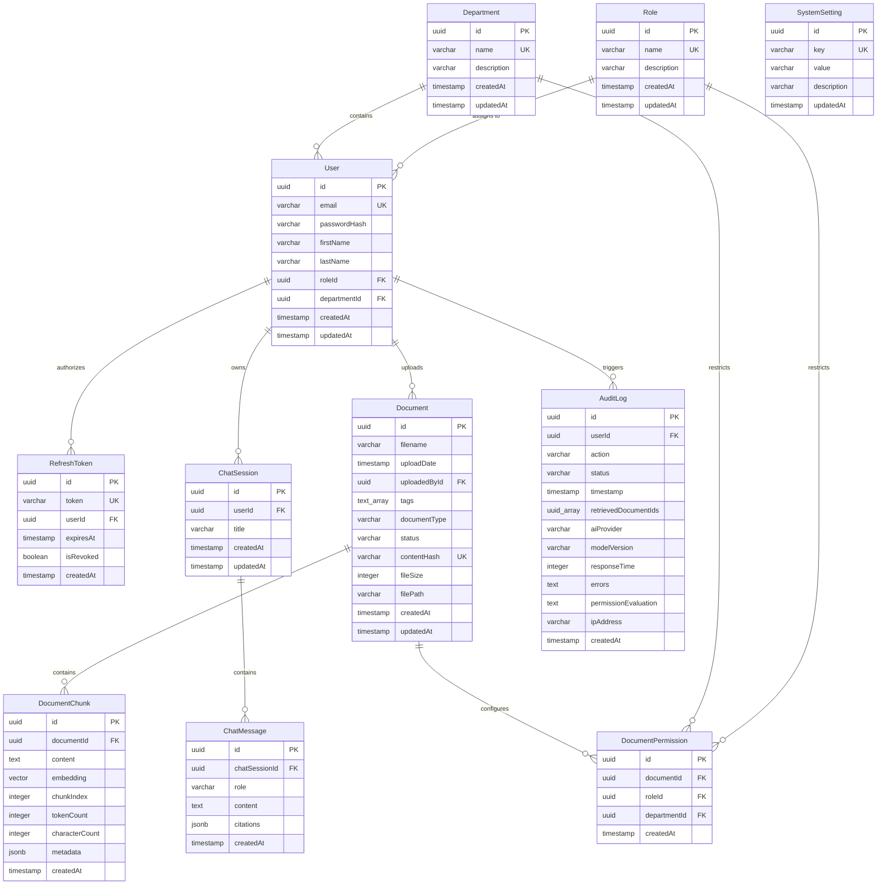

# Database Design Document

This document outlines the database architecture, schema definitions, indexing strategies, vector storage structures, security measures, and migration guidelines for **EnterpriseIQ**. It serves as the authoritative database blueprint for Version 1 implementation.

---

## 1. Executive Summary

EnterpriseIQ Version 1 is designed as a secure, single-tenant enterprise system. To maintain high operational velocity and minimize infrastructure complexity, the database strategy utilizes a unified database approach:

* **Unified Database Engine (PostgreSQL)**: Serves as both the relational database and the vector search engine. All system metadata, user details, access roles, document catalogs, audit trails, and vector embeddings are stored in a single PostgreSQL instance.
* **Why PostgreSQL + pgvector were selected**: 
  - **Operational Simplicity**: Avoids the complexity of provisioning, coordinating, and backing up a separate vector database (e.g., Pinecone, Qdrant).
  - **Atomic Transactions**: Guarantees transaction completeness across relational data and vector arrays. When a document is deleted, both the metadata and the vector chunks are cleared in a single atomic SQL transaction.
  - **Relational Filtering with Vector Search**: Allows joining relational access permissions (RBAC constraints) directly with semantic search queries in a single query execution plan.
  - **Maturity**: PostgreSQL is a highly reliable database engine with standard tooling for backups, replicas, security, and performance tuning.
* **Single Database Sufficiency**: A single PostgreSQL instance with the `pgvector` extension is fully capable of handling normal enterprise workloads (tens of thousands of documents and millions of chunks) with low similarity query latency, making it the ideal solution for Version 1.

---

## 2. Database Characteristics

The database engine has the following core qualities that define its operational capabilities:

* **ACID Compliant**: Guarantees that database modifications (such as simultaneous text ingestion and status changes) execute with atomicity, consistency, isolation, and durability.
* **Relational-first**: Enforces relational data layouts, schema constraints, and foreign key rules, protecting system transactions from data errors.
* **Vector-enabled**: Employs the `pgvector` database extension to store, index, and query vector representations within PostgreSQL tables.
* **UUID-based**: Primary key columns utilize universally unique identifiers (UUIDv4) to guarantee key isolation.
* **Fully Normalized**: Designed to Third Normal Form (3NF) standards to eliminate redundancy and maintain database consistency.
* **Secure by Design**: Enforces schema rules, hashed secrets, and SQL parameters directly at the database tier.
* **Audit Friendly**: Tracks query patterns, model changes, and system errors in write-only audit logs.
* **Migration Driven**: Tracks schema updates using version-controlled migration files in the git repository.
* **AI Provider Agnostic**: Stores vectors using variable length markers `VECTOR(n)`, allowing model swaps without schema updates.
* **Storage Provider Ready**: Decouples binary file systems from DB structures by storing file paths rather than large blobs.
* **Single Tenant (Version 1)**: Configured as a single-tenant database instance to keep deployments simple.
* **Multi-tenant Ready**: Designed with columns, enums, and foreign keys that can transition to multi-tenant workspaces.

---

## 3. Naming Standards

To ensure consistency between database schemas, ORM configuration files, and backend services, developers must follow these naming standards:

* **PostgreSQL Tables**: Written in `snake_case` (e.g. `document_chunks`, `audit_logs`).
* **Prisma Models**: Written in `PascalCase` (e.g. `DocumentChunk`, `AuditLog`).
* **TypeScript Properties**: Written in `camelCase` (e.g. `documentId`, `characterCount`).
* **Enums**: Model name and properties written in `PascalCase` (e.g. `UserRole`, `DocumentStatus`).
* **Foreign Keys**: Constructed as `<entity>Id` in camelCase (e.g. `roleId`, `departmentId`).
* **Primary Keys**: Assigned as `id` in lowercase.
* **Timestamps**: Uses `createdAt` (row creation) and `updatedAt` (row update). Future updates may introduce a `deletedAt` column for soft deletes.

Adhering to these standards reduces cognitive load when transitioning between backend services, database migrations, and client models, improving codebase maintainability.

---

## 4. Database Design Principles

* **UUID Primary Keys**: Every database table uses universally unique identifiers (UUIDv4) as primary keys. This prevents primary key collisions and guarantees safe future migration into distributed or multi-tenant database clusters.
* **Referential Integrity**: Strict foreign key constraints are declared at the database engine level, ensuring relational consistency and preventing orphaned data rows.
* **Database Normalization**: Schemas conform to Third Normal Form (3NF) to eliminate data redundancy and keep operational tables clean.
* **Soft Deletes where appropriate**: Documents can be flagged as inactive or deleted to maintain transaction history for audit logs while removing them from active user search indices.
* **Audit Timestamps**: Every table contains standard audit columns (`createdAt` and `updatedAt`) managed by the ORM layer to record row creation and update timestamps.
* **Index-First Design**: All lookup columns, foreign keys, and status flags used in query filters have explicit database indexes to keep search latencies low under operational volumes.
* **Security by Design**: Sensitive data, such as passwords, is stored hashed. Columns are set to NOT NULL by default unless explicitly designed to be nullable.
* **Schema Extensibility**: Schemas are decoupled from cloud provider implementations, allowing easy updates to cloud storage services and advanced identity providers in future iterations.

---

## 5. Database Architecture Diagram

The entity-relationship diagram below maps all core system tables, showing primary keys, foreign keys, and relational cardinality:

---

## 6. Entity Overview

* **Users**: Represents the core identity structure. Stores email addresses, password hashes, references to departments, and references to associated roles.
* **Roles**: Encapsulates user privileges (Administrator, Manager, Employee). Enables Role-Based Access Control (RBAC) validations across backend controllers.
* **Departments**: Represents formal company departments, allowing user filtering and document access control restrictions.
* **Document Permissions**: Provides authorization parameters linking documents to roles and/or departments, controlling workspace access.
* **Refresh Tokens**: Used to manage secure, rotating user sessions, supporting short-lived access tokens and token revocation.
* **Documents**: Logs physical files uploaded to the platform, including metadata tags, ownership references, and chunking states.
* **Document Chunks**: Stores segments of raw document text alongside their high-dimensional vector embeddings, token lengths, and character counts.
* **Chat Sessions**: Represents individual conversational threads started by users.
* **Chat Messages**: Records messages in a chat session, indicating the speaker role (User, Assistant, System) and matching RAG source citations.
* **Audit Logs**: A write-only compliance ledger tracking user requests, processing times, API calls, completion status, error traces, and RBAC evaluations.
* **System Settings**: A key-value store for global configurations, including active model names, rate limiting numbers, and file upload size thresholds.

---

## 7. Table Design

This section lists the properties, column configurations, indices, constraints, and relationships for each table.

### 7.1. Users Table
* **Purpose**: Manages user accounts and credentials.
* **Columns**:
  - `id`: UUID (Primary Key, default: `uuid_generate_v4()`)
  - `email`: VARCHAR(255) (Unique, NOT NULL)
  - `passwordHash`: VARCHAR(255) (NOT NULL)
  - `firstName`: VARCHAR(100) (NOT NULL)
  - `lastName`: VARCHAR(100) (NOT NULL)
  - `roleId`: UUID (Foreign Key -> roles.id, NOT NULL)
  - `departmentId`: UUID (Foreign Key -> departments.id, NOT NULL)
  - `createdAt`: TIMESTAMP (NOT NULL, default: `now()`)
  - `updatedAt`: TIMESTAMP (NOT NULL, default: `now()`)
* **Primary Key**: `id`
* **Foreign Keys**: 
  - `roleId` referencing `roles(id)` (ON DELETE RESTRICT)
  - `departmentId` referencing `departments(id)` (ON DELETE RESTRICT)
* **Indexes**: Unique index on `email`, Index on `departmentId`.
* **Constraints**: Email format validation, NOT NULL fields.
* **Relationships**: Many-to-One with `Role`, Many-to-One with `Department`, One-to-Many with `RefreshToken`, `Document`, `ChatSession`, `AuditLog`.
* **Validation Rules**: Email must contain `@` and domain structure.
* **Suggested Prisma model name**: `User`

### 7.2. Roles Table
* **Purpose**: Defines system RBAC roles.
* **Columns**:
  - `id`: UUID (Primary Key)
  - `name`: UserRole Enum (Unique, NOT NULL)
  - `description`: VARCHAR(255) (Nullable)
  - `createdAt`: TIMESTAMP (NOT NULL, default: `now()`)
  - `updatedAt`: TIMESTAMP (NOT NULL, default: `now()`)
* **Primary Key**: `id`
* **Foreign Keys**: None
* **Indexes**: Unique index on `name`.
* **Constraints**: Unique role name.
* **Relationships**: One-to-Many with `User`, One-to-Many with `DocumentPermission`.
* **Validation Rules**: Must match UserRole enum values.
* **Suggested Prisma model name**: `Role`

### 7.3. Departments Table
* **Purpose**: Stores system organizational departments.
* **Columns**:
  - `id`: UUID (Primary Key)
  - `name`: VARCHAR(100) (Unique, NOT NULL)
  - `description`: VARCHAR(255) (Nullable)
  - `createdAt`: TIMESTAMP (NOT NULL, default: `now()`)
  - `updatedAt`: TIMESTAMP (NOT NULL, default: `now()`)
* **Primary Key**: `id`
* **Foreign Keys**: None
* **Indexes**: Unique index on `name`.
* **Constraints**: Unique department name.
* **Relationships**: One-to-Many with `User`, One-to-Many with `DocumentPermission`.
* **Validation Rules**: Non-empty name.
* **Why normalization improves consistency**: Normalizing departments into a distinct table prevents spelling errors (e.g. "HR" vs "Human Resources"), simplifies metadata filtering and department auditing, and prevents duplicate department definitions.
* **Suggested Prisma model name**: `Department`

### 7.4. DocumentPermissions Table
* **Purpose**: Restricts document access to specific roles and/or departments.
* **Columns**:
  - `id`: UUID (Primary Key)
  - `documentId`: UUID (Foreign Key -> documents.id, NOT NULL)
  - `roleId`: UUID (Foreign Key -> roles.id, Nullable)
  - `departmentId`: UUID (Foreign Key -> departments.id, Nullable)
  - `createdAt`: TIMESTAMP (NOT NULL, default: `now()`)
* **Primary Key**: `id`
* **Foreign Keys**:
  - `documentId` referencing `documents(id)` (ON DELETE CASCADE)
  - `roleId` referencing `roles(id)` (ON DELETE CASCADE)
  - `departmentId` referencing `departments(id)` (ON DELETE CASCADE)
* **Indexes**: Index on `documentId`, Index on `roleId`, Index on `departmentId`.
* **Constraints**: Check constraint verifying that at least one of `roleId` or `departmentId` is NOT NULL.
* **Relationships**: Many-to-One with `Document`, Many-to-One with `Role`, Many-to-One with `Department`.
* **Validation Rules**: Document access mapping logic.
* **Suggested Prisma model name**: `DocumentPermission`

### 7.5. RefreshTokens Table
* **Purpose**: Manages secure sessions and token rotations.
* **Columns**:
  - `id`: UUID (Primary Key)
  - `token`: VARCHAR(512) (Unique, NOT NULL)
  - `userId`: UUID (Foreign Key -> users.id, NOT NULL)
  - `expiresAt`: TIMESTAMP (NOT NULL)
  - `isRevoked`: BOOLEAN (NOT NULL, default: `false`)
  - `createdAt`: TIMESTAMP (NOT NULL, default: `now()`)
* **Primary Key**: `id`
* **Foreign Keys**: `userId` referencing `users(id)` (ON DELETE CASCADE)
* **Indexes**: Unique index on `token`, index on `userId`.
* **Constraints**: Non-empty token.
* **Relationships**: Many-to-One with `User`.
* **Validation Rules**: Token string format checks.
* **Suggested Prisma model name**: `RefreshToken`

### 7.6. Documents Table
* **Purpose**: Catalogs files uploaded to the platform.
* **Columns**:
  - `id`: UUID (Primary Key)
  - `filename`: VARCHAR(512) (NOT NULL)
  - `uploadDate`: TIMESTAMP (NOT NULL, default: `now()`)
  - `uploadedById`: UUID (Foreign Key -> users.id, NOT NULL)
  - `tags`: VARCHAR(100)[] (NOT NULL, default: `{}`)
  - `documentType`: VARCHAR(50) (NOT NULL)
  - `status`: DocumentStatus Enum (NOT NULL, default: `Pending`)
  - `contentHash`: VARCHAR(64) (Unique, NOT NULL)
  - `fileSize`: INTEGER (NOT NULL)
  - `filePath`: VARCHAR(512) (NOT NULL)
  - `createdAt`: TIMESTAMP (NOT NULL, default: `now()`)
  - `updatedAt`: TIMESTAMP (NOT NULL, default: `now()`)
* **Primary Key**: `id`
* **Foreign Keys**: `uploadedById` referencing `users(id)` (ON DELETE RESTRICT)
* **Indexes**: Unique index on `contentHash`, index on `status`, index on `uploadedById`.
* **Constraints**: `fileSize` > 0, `contentHash` SHA-256 validation.
* **Relationships**: Many-to-One with `User`, One-to-Many with `DocumentChunk`, One-to-Many with `DocumentPermission`.
* **Validation Rules**: Allowed file extensions (.pdf, .docx, .txt).
* **Suggested Prisma model name**: `Document`

### 7.7. DocumentChunks Table
* **Purpose**: Stores parsed text chunks and matching vector embeddings.
* **Columns**:
  - `id`: UUID (Primary Key)
  - `documentId`: UUID (Foreign Key -> documents.id, NOT NULL)
  - `content`: TEXT (NOT NULL)
  - `embedding`: VECTOR(n) (NOT NULL)
  - `chunkIndex`: INTEGER (NOT NULL)
  - `tokenCount`: INTEGER (NOT NULL)
  - `characterCount`: INTEGER (NOT NULL)
  - `metadata`: JSONB (NOT NULL, default: `{}`)
  - `createdAt`: TIMESTAMP (NOT NULL, default: `now()`)
* **Primary Key**: `id`
* **Foreign Keys**: `documentId` referencing `documents(id)` (ON DELETE CASCADE)
* **Indexes**: Index on `documentId`, Index on `chunkIndex`, HNSW vector index on `embedding`.
* **Constraints**: `chunkIndex` >= 0, `tokenCount` > 0, `characterCount` > 0.
* **Relationships**: Many-to-One with `Document`.
* **Validation Rules**: Vector boundaries must match model coordinates.
* **Why storing tokens & characters improves execution**:
  - **Retrieval Optimization**: Helps search queries balance dense information segments.
  - **Debugging**: Inspecting split segments for alignment issues.
  - **Analytics**: Estimating overall token and billing costs.
  - **Tuning**: Informs threshold configurations for chunk size configurations in the future.
* **Suggested Prisma model name**: `DocumentChunk`

### 7.8. ChatSessions Table
* **Purpose**: Group message histories into conversational threads.
* **Columns**:
  - `id`: UUID (Primary Key)
  - `userId`: UUID (Foreign Key -> users.id, NOT NULL)
  - `title`: VARCHAR(255) (NOT NULL)
  - `createdAt`: TIMESTAMP (NOT NULL, default: `now()`)
  - `updatedAt`: TIMESTAMP (NOT NULL, default: `now()`)
* **Primary Key**: `id`
* **Foreign Keys**: `userId` referencing `users(id)` (ON DELETE CASCADE)
* **Indexes**: Index on `userId`.
* **Constraints**: Non-empty title.
* **Relationships**: Many-to-One with `User`, One-to-Many with `ChatMessage`.
* **Validation Rules**: Title length checks.
* **Suggested Prisma model name**: `ChatSession`

### 7.9. ChatMessages Table
* **Purpose**: Records individual message logs.
* **Columns**:
  - `id`: UUID (Primary Key)
  - `chatSessionId`: UUID (Foreign Key -> chat_sessions.id, NOT NULL)
  - `role`: ChatMessageRole Enum (NOT NULL)
  - `content`: TEXT (NOT NULL)
  - `citations`: JSONB (NOT NULL, default: `[]`)
  - `createdAt`: TIMESTAMP (NOT NULL, default: `now()`)
* **Primary Key**: `id`
* **Foreign Keys**: `chatSessionId` referencing `chat_sessions(id)` (ON DELETE CASCADE)
* **Indexes**: Index on `chatSessionId`, Index on `createdAt`.
* **Constraints**: Non-empty content.
* **Relationships**: Many-to-One with `ChatSession`.
* **Validation Rules**: Role must match valid ChatMessageRole enum.
* **Suggested Prisma model name**: `ChatMessage`

### 7.10. AuditLogs Table
* **Purpose**: High-fidelity operational audit trails.
* **Columns**:
  - `id`: UUID (Primary Key)
  - `userId`: UUID (Foreign Key -> users.id, Nullable)
  - `action`: AuditAction Enum (NOT NULL)
  - `status`: AuditLogStatus Enum (NOT NULL, default: `SUCCESS`)
  - `timestamp`: TIMESTAMP (NOT NULL, default: `now()`)
  - `retrievedDocumentIds`: UUID[] (NOT NULL, default: `{}`)
  - `aiProvider`: VARCHAR(100) (Nullable)
  - `modelVersion`: VARCHAR(100) (Nullable)
  - `responseTime`: INTEGER (NOT NULL)
  - `errors`: TEXT (Nullable)
  - `permissionEvaluation`: TEXT (Nullable)
  - `ipAddress`: VARCHAR(45) (NOT NULL)
  - `createdAt`: TIMESTAMP (NOT NULL, default: `now()`)
* **Primary Key**: `id`
* **Foreign Keys**: `userId` referencing `users(id)` (ON DELETE SET NULL)
* **Indexes**: Index on `userId`, Index on `action`, Index on `timestamp`.
* **Constraints**: `responseTime` >= 0.
* **Relationships**: Many-to-One with `User`.
* **Validation Rules**: Action validation matches AuditAction enum.
* **Why the status column improves audits**:
  - **Operational Monitoring**: Identifies failing LLM queries or backend timeouts.
  - **Security Audits**: Tracks failed access requests (`DENIED`) to identify potential security threats.
  - **Metrics Dashboarding**: Simplifies reporting metrics on system errors.
* **Suggested Prisma model name**: `AuditLog`

### 7.11. SystemSettings Table
* **Purpose**: Centralized platform configuration settings.
* **Columns**:
  - `id`: UUID (Primary Key)
  - `key`: VARCHAR(255) (Unique, NOT NULL)
  - `value`: VARCHAR(2048) (NOT NULL)
  - `description`: VARCHAR(512) (Nullable)
  - `updatedAt`: TIMESTAMP (NOT NULL, default: `now()`)
* **Primary Key**: `id`
* **Foreign Keys**: None
* **Indexes**: Unique index on `key`.
* **Constraints**: Unique config key names.
* **Relationships**: None
* **Validation Rules**: Valid key syntax formats.
* **Suggested Prisma model name**: `SystemSetting`

---

## 8. Relationship Design

* **One-to-Many**: Defines standard parent-child models. For example, a `User` owns multiple `ChatSessions`, and a `Document` contains multiple `DocumentChunks`.
* **Many-to-One**: Declares child-parent relations. For example, multiple `RefreshTokens` reference a single `User`.
* **Cascade Delete**: Automatically cleans up associated records. If a `Document` is deleted, all corresponding `DocumentChunks` and `DocumentPermissions` are cascade-deleted (`ON DELETE CASCADE`) to prevent orphans. The same rules apply to deleting `ChatSessions` and cascade-deleting `ChatMessages`.
* **Restrict Delete**: Prevents deletion of records if dependent records exist. A `User` record cannot be deleted if there are associated `Documents` uploaded by that user (`ON DELETE RESTRICT`), preserving metadata validity. Similarly, a `Department` cannot be deleted if users are still assigned to it.
* **Optional Relationships**: Handled via nullable columns. In `AuditLogs`, the `userId` column is nullable. If a user is deleted from the system, their audit log history is preserved, and the foreign key shifts to NULL (`ON DELETE SET NULL`). In `DocumentPermissions`, the `roleId` and `departmentId` columns are nullable, allowing a permission to target a department, a role, or both.
* **Required Relationships**: Declared using the `NOT NULL` modifier on foreign key columns, ensuring that tables like `ChatMessage` always reference a valid `ChatSession`.

---

## 9. Enum Design

Enums define structured, valid values at the database level:

### 9.1. UserRole
* `Administrator`: Full system settings administration, audit logs access, document ingestion, and user management.
* `Manager`: Upload and list department files, monitor ingestion, and run semantic RAG searches.
* `Employee`: Execute document searches and conversational chat actions.

### 9.2. DocumentStatus
* `Pending`: The uploaded document metadata record is registered and waiting for text parsing.
* `Processing`: The text parser is running extraction, chunking, and embedding generation processes.
* `Completed`: All vector embeddings are stored in `pgvector` and the document is searchable.
* `Failed`: Parsing, chunking, or embedding operations failed. The error is logged.

### 9.3. ChatMessageRole
* `User`: Text entered by the user.
* `Assistant`: Text generated by Google Gemini.
* `System`: Instructions injected into the conversational model prompts.

### 9.4. AuditAction
* `Login`: Session token requested and generated.
* `Logout`: Session token revoked or expired.
* `Upload`: Document uploaded and processing started.
* `Delete`: Document removed from index.
* `Search`: Keyword or semantic queries executed.
* `Chat`: RAG multi-turn prompt completed.

### 9.5. AuditLogStatus
* `SUCCESS`: The action completed successfully.
* `FAILED`: An error occurred during request processing.
* `DENIED`: The action was rejected due to insufficient permissions.

---

## 10. Vector Storage Design

To query semantic similarity directly inside PostgreSQL, the system uses the `pgvector` database extension.

### 10.1. DocumentChunk Configuration
Vector data is stored inside the `document_chunks` table using the following structure:
* `id`: UUID primary key.
* `documentId`: References the parent document.
* `content`: Plain text content snippet.
* `embedding`: Stored as a database column of type `VECTOR(n)`, representing the floating point values generated by the configured embedding model. *Note: n represents the model dimensions. Version 1 uses Google's Gemini embedding model (text-embedding-004) generating 768 dimensions (n=768), but the schema is designed to remain provider-agnostic.*
* `chunkIndex`: Records segment order to reconstruct citations.
* `metadata`: JSONB payload storing file tags, departments, and ACL properties.

### 10.2. Hybrid Metadata Integration
Storing vector embeddings together with relational tables provides significant architectural advantages:
* **Single-Query RBAC Enforcement**: Queries can apply standard SQL `WHERE` clauses (e.g. filtering on department tags or roles) combined with vector similarity math, avoiding multi-stage checks across separate databases.
* **Consistent Transactions**: Avoids out-of-sync states between relational registries and external vector indexes (e.g. deleting a document deletes all its vector records atomically).
* **Simplified Backups**: The database, metadata records, and vectors are backed up together in a single `pg_dump` backup file.

---

## 11. Index Strategy

To maintain low latency under normal enterprise workloads, the system utilizes the following database index designs:

* **Unique Index on `users.email`**: Ensures email addresses are unique and enables O(1) email lookups during login.
* **Index on `users.departmentId`**: Optimizes profile mapping lookups by department.
* **Index on `documents.uploadedById`**: Optimizes list queries filtering documents by uploader.
* **Index on `documents.status`**: Accelerates pipeline updates tracking documents in `Processing` or `Pending` status.
* **Composite Index on `document_chunks(documentId, chunkIndex)`**: Speeds up retrieving document text chunks in order when formatting prompt context.
* **Unique Index on `refresh_tokens.token`**: Accelerates token validation and session rotation checks.
* **Index on `chat_messages.chatSessionId`**: Optimizes chat history retrieval for conversational UI components.
* **Index on `audit_logs.userId` and `audit_logs.timestamp`**: Speeds up compliance queries when filtering logs by date range and user.
* **Vector Index**: An HNSW (Hierarchical Navigable Small World) index is configured on the `embedding` column of the `document_chunks` table:
  - **Metric**: Cosine distance (using the `<=>` operator).
  - **Parameters**: Custom tuning (e.g., `m=16`, `ef_construct=64`) to balance index build time and query retrieval accuracy.

---

## 12. Constraints

The database engine enforces schema validation rules at the storage tier:

* **Unique Constraints**:
  - `users(email)`
  - `roles(name)`
  - `departments(name)`
  - `refresh_tokens(token)`
  - `documents(contentHash)` (Prevents processing duplicate documents)
  - `system_settings(key)`
* **Foreign Key Constraints**: Standard validation checking that relations point to valid parent IDs, utilizing ON DELETE CASCADE/RESTRICT rules.
* **Check Constraints**:
  - `documents(fileSize > 0)`
  - `document_chunks(chunkIndex >= 0)`
  - `document_chunks(tokenCount > 0)`
  - `document_chunks(characterCount > 0)`
  - `document_permissions(roleId IS NOT NULL OR departmentId IS NOT NULL)` (Ensures a permission specifies a role, department, or both)
* **NOT NULL Constraints**: Applied by default to all columns unless explicitly designed to be nullable (such as `audit_logs.userId` or `system_settings.description`).
* **Default Values**:
  - Primary key `id` defaults to auto-generated UUIDv4.
  - Timestamps default to `now()`.
  - Ingestion status defaults to `Pending`.
  - Document tags array defaults to `{}` (empty text array).

---

## 13. Database Security

* **Password Hashing**: User passwords must never be stored in plain text. The application hashes passwords using bcrypt (or Argon2) before saving them to the `passwordHash` column.
* **Refresh Token Hashing**: Refresh tokens can be hashed in the database before storage. Once issued, token checks are performed using hash comparisons to prevent token exposure in case of database leakage.
* **RBAC Enforcement**: The database roles table defines permissions. Database access queries automatically join the roles table, restricting data access based on the user's role context.
* **SQL Injection Protection**: The system interacts with the database exclusively using the Prisma ORM. Prisma automatically parameterizes SQL statements, preventing SQL injection vulnerabilities.
* **Audit Logs Protection**: The `audit_logs` table has restricted write-only permissions. The backend API is not allowed to update or delete audit records, protecting system logs.

---

## 14. Migration Strategy

* **Prisma Migrations**: All schema modifications are handled using Prisma Migrations. Manual schema edits on target environments are strictly prohibited.
* **Versioning**: Schema migrations are stored in the version control repository under `prisma/migrations/`. Each migration is named with a timestamp and a descriptive tag.
* **Rollback Strategy**: Prisma migrations are applied in order. If a migration fails, the database is rolled back to the previous state using standard backup restoration or rollback migration scripts.
* **Seed Data**: System initialization scripts populate default roles (`Administrator`, `Manager`, `Employee`), default departments, and initial system settings in the target database.
* **Development Workflow**: Developers run `prisma migrate dev` locally to test migrations, which automatically generates migration files before deployment.

---

## 15. Backup & Recovery

* **Database Backups**: Automated nightly backups are scheduled using `pg_dump`. Backup files are securely compressed and copied to isolated storage backends.
* **File Backups**: Uploaded source documents in Local Storage are backed up using standard directory synchronization tools.
* **Recovery Strategy**: In case of a database crash, the database engine is restored from the last clean backup, and incremental transaction logs are replayed.
* **Disaster Recovery**: Backup procedures are tested quarterly, verifying data integrity and measuring recovery timelines to meet project requirements.

---

## 16. Future Evolution

The database structure is designed to support future requirements without requiring a major redesign:

* **Multi-tenancy**: Upgrading the database to multi-tenancy can be achieved by adding a `tenantId` (UUID) column to all tables. Tenant isolation can then be enforced by adding `tenantId` conditions to search indexes and queries.
* **Cloud Storage**: Transitioning from local filesystem storage to AWS S3 (or Azure Blob Storage) requires updating the `filePath` column in the `documents` table to store bucket URLs.
* **SharePoint Connectors**: Syncing with SharePoint or Google Drive involves creating a connector registry table that maps to the existing `documents` table using source URLs.
* **OCR**: If OCR is introduced, parsed document chunks can be stored in the existing `document_chunks` table without schema modifications.
* **Hybrid Search**: Adding lexical keyword queries (like BM25) can be supported by enabling full-text search indexes on the `content` column of the `document_chunks` table.

---

## 17. Database ADRs

### ADR-001: Use PostgreSQL
* **Decision**: Use PostgreSQL as the primary database engine.
* **Reason**: Highly mature, ACID-compliant, supports pgvector, and is fully sufficient for single-tenant enterprise deployments.
* **Trade-off**: Harder to scale horizontally compared to NoSQL engines, but acceptable for Version 1 scope.

### ADR-002: Use pgvector
* **Decision**: Use the pgvector extension for storing and searching vector embeddings.
* **Reason**: Avoids the complexity of managing a separate vector database. Allows metadata filtering and similarity searches in a single SQL query.
* **Trade-off**: Lower search throughput on scale compared to dedicated engines like Pinecone. This is acceptable for single-tenant workloads.

### ADR-003: Use UUID Keys
* **Decision**: Use UUIDv4 for all primary keys.
* **Reason**: Prevents key collisions and simplifies future data migration or database partitioning.
* **Trade-off**: Slightly higher storage requirements compared to incremental integer keys.

### ADR-004: Use Prisma ORM
* **Decision**: Use Prisma ORM for database access.
* **Reason**: Provides type-safe queries, auto-generated migrations, and protects against SQL injection.
* **Trade-off**: Introduces an abstraction layer. Direct SQL queries can still be executed for advanced vector functions.

### ADR-005: Store Files Separately from Metadata
* **Decision**: Store uploaded source documents on the filesystem, saving only file paths in the database.
* **Reason**: Prevents database bloat, keeping database backups and indexing operations fast.
* **Trade-off**: Requires backing up both the database and the filesystem folder.

### ADR-006: Store Embeddings in PostgreSQL
* **Decision**: Store chunk text and vector embeddings in the same PostgreSQL database.
* **Reason**: Simplifies RAG pipelines, ensuring database operations and metadata filtering remain atomic.
* **Trade-off**: Increases database storage requirements.

### ADR-007: Use Refresh Tokens
* **Decision**: Implement Refresh Tokens for session management.
* **Reason**: Allows secure session rotation, supporting short-lived JWT access tokens.
* **Trade-off**: Requires database storage to track and revoke active refresh tokens.

### ADR-008: Use Audit Logs
* **Decision**: Save detailed audit logs to a dedicated PostgreSQL table.
* **Reason**: Provides compliance tracking for SOC 2 security audits.
* **Trade-off**: Increases database write volume.

---

Document Status

Version: 1.0

Status: BASELINE APPROVED

Approved By

- Product Owner
- Software Architect

Related Documents

- [Product Requirements Specification](Product_Requirements_Specification.md)
- [Architecture Principles](Architecture_Principles.md)
- [Engineering Standards](Engineering_Standards.md)
- [System Architecture](System_Architecture.md)

-------------------------------------------------
