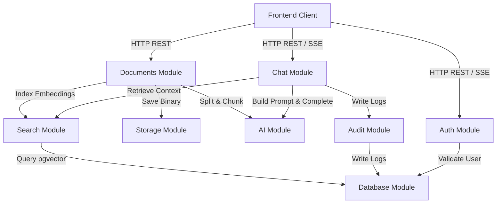

This architecture is governed by:

- [Product Requirements Specification](Product_Requirements_Specification.md)
- [Architecture Principles](Architecture_Principles.md)
- [Engineering Standards](Engineering_Standards.md)
- [System Architecture](System_Architecture.md)
- [Database Design](Database_Design.md)
- [RAG Architecture](RAG_Architecture.md)
- [API Design](API_Design.md)
- [Security Model](Security_Model.md)

These documents collectively define the EnterpriseIQ Version 1 directory structure.

---

# Codebase Folder Structure Document

This document defines the canonical repository layout, directory hierarchy, component boundaries, and Clean Architecture dependency patterns for **EnterpriseIQ**. It serves as the authoritative blueprint for codebase implementation.

---

## 1. Executive Summary

EnterpriseIQ is built as a single-tenant Modular Monolith using a monorepository structure, separating backend services and web clients into discrete directory boundaries under a single workspace.

### 1.1. Why the Modular Monolith was Selected
A Modular Monolith represents the ideal balance between operational simplicity and code maintainability:
* **Operational Simplicity**: Deployment requires only a single backend process container, eliminating network lag, distributed message brokers, API gateways, and service meshes.
* **Logical Isolation**: Code is structured into modules with strict boundaries (e.g. auth, users, documents, chat), preventing tight coupling.
* **Refactoring Path**: If a module (e.g. text parser or vector search) requires horizontal scaling in the future, its isolated structure allows developers to easily split it into a standalone service.

### 1.2. Architecture Benefits
* **Maintainability**: Clear boundaries prevent developers from creating circular dependencies or importing raw configurations.
* **Scalability**: By organizing code logically, developers can work on distinct features independently without introducing compile errors.
* **Onboarding**: A standardized directory tree aligns with NestJS and Next.js best practices, allowing new engineers to navigate the codebase immediately.

---

## 2. Repository Structure

Below is the directory tree for the EnterpriseIQ workspace:

```text
EnterpriseIQ/
├── README.md                      # Project orientation and setup guidelines
├── LICENSE                        # License permissions
├── .env.example                   # Environment configuration variables template
├── package.json                   # Monorepo workspace configuration
├── tsconfig.json                  # Workspace TypeScript settings
├── .github/                       # GitHub configurations directory
│   └── workflows/                 # Reserved for future CI/CD automated workflows
├── docker/                        # Deployment configuration files
│   ├── Dockerfile.backend         # Production Dockerfile for NestJS backend
│   ├── Dockerfile.frontend        # Production Dockerfile for Next.js frontend
│   └── docker-compose.yml         # Container coordinator orchestrating DB and apps
├── docs/                          # Authoritative specifications and architecture logs
│   ├── Product_Requirements_Specification.md
│   ├── Architecture_Principles.md
│   ├── Engineering_Standards.md
│   ├── System_Architecture.md
│   ├── Database_Design.md
│   ├── RAG_Architecture.md
│   ├── API_Design.md
│   ├── Security_Model.md
│   └── Folder_Structure.md
├── logs/                          # Gitignored directory storing application error trace dumps
├── scripts/                       # Operational management scripts
│   ├── setup.ts                   # Local development environment setup script
│   ├── db-backup.sh               # pg_dump backup script
│   └── db-restore.sh              # pg_restore database recovery script
└── apps/                          # Deployable system applications
    ├── backend/                   # NestJS REST backend application (Modular Monolith)
    │   ├── package.json
    │   ├── tsconfig.json
    │   ├── prisma/                # Standard Prisma integration directory
    │   │   ├── schema.prisma      # Relational and vector schema design
    │   │   ├── migrations/        # Database version-controlled migration files
    │   │   └── seed.ts            # Default roles and settings database seed script
    │   ├── src/                   # Backend application source
    │   ├── storage/               # Storage uploads persistence boundary
    │   │   └── uploads/           # Persisted manual uploads (Gitignored and Docker mounted)
    │   └── test/                  # Automated backend test suites
    └── frontend/                  # Next.js web dashboard client application
        ├── package.json
        ├── tsconfig.json
        ├── tailwind.config.js
        ├── public/                # Static assets (images, fonts, icons)
        └── src/                   # Frontend client source
```

---

## 3. Backend Folder Structure

The NestJS backend application (`apps/backend/`) is structured into modules:

```text
apps/backend/
├── prisma/                        # Standard Prisma ORM integration directory
│   ├── schema.prisma              # Relational and vector schema design
│   ├── migrations/                # Schema migrations history
│   └── seed.ts                    # Default roles, departments, and system settings seeds
├── src/
│   ├── main.ts                    # Application entry point (bootstrap backend monolith)
│   ├── app.module.ts              # Root NestJS module importing child modules
│   ├── common/                    # Reusable NestJS framework components (Guards, Pipes, Middleware)
│   │   ├── filters/               # Global exception filters
│   │   ├── interceptors/          # Response mapping and logging interceptors
│   │   ├── pipes/                 # Custom validation and transformation pipes
│   │   ├── guards/                # Framework authentication guards
│   │   └── middleware/            # Rate limiting or request tracing middleware
│   ├── shared/                    # Dependency-free utilities (date formats, string math helpers)
│   │   ├── constants/             # Global variables
│   │   ├── exceptions/            # Custom application error handlers
│   │   └── utils/                 # General text formatting utilities
│   ├── auth/                      # Session, credentials, JWT, and authentication logic
│   │   ├── controllers/           # Auth REST endpoints controllers
│   │   ├── services/              # Login, token generation, and logout services
│   │   ├── dto/                   # Login and register DTO schemas
│   │   └── domain/                # Lightweight Domain layer
│   │       ├── entities/          # Auth entity definitions
│   │       └── interfaces/        # Auth boundary interfaces
│   ├── users/                     # User records management module
│   │   ├── controllers/
│   │   ├── services/
│   │   ├── dto/
│   │   ├── repositories/          # Prisma database access implementations
│   │   └── domain/
│   │       ├── entities/
│   │       └── interfaces/        # IUserRepository definitions
│   ├── documents/                 # File uploads, text extraction, and metadata management
│   │   ├── controllers/
│   │   ├── services/              # Ingestion orchestration, text extraction services
│   │   ├── dto/
│   │   ├── repositories/          # IDocumentRepository database mapping
│   │   └── domain/
│   │       ├── entities/
│   │       └── interfaces/
│   ├── chat/                      # Conversational sessions, histories, and citation logic
│   │   ├── controllers/
│   │   ├── services/              # Session management and citation mapper services
│   │   ├── dto/
│   │   ├── repositories/
│   │   └── domain/
│   │       ├── entities/
│   │       └── interfaces/
│   ├── search/                    # pgvector similarity searches
│   │   ├── services/              # Vector search orchestration service
│   │   ├── dto/
│   │   ├── repositories/          # Vector retrieval execution repositories
│   │   └── domain/
│   │       ├── entities/
│   │       └── interfaces/
│   ├── ai/                        # Abstraction wrapper around Google Gemini and LangChain
│   │   ├── providers/             # Target AI provider integrations
│   │   │   └── gemini/            # Gemini API integration wrapper
│   │   ├── prompt-builder/        # System and context formatting services
│   │   ├── citation-builder/      # Text citation matching services
│   │   └── interfaces/            # IAIProvider abstractions (Domain)
│   ├── storage/                   # Abstraction wrapper around physical disk storage
│   │   ├── providers/
│   │   │   └── local/             # Local filesystem read/write services
│   │   └── interfaces/            # IStorageProvider boundary interfaces
│   ├── audit/                     # Operational compliance logs
│   │   ├── services/              # Log insertion services
│   │   ├── repositories/          # Log database repository implementations
│   │   └── interfaces/            # IAuditRepository abstractions
│   └── admin/                     # System settings and platform variables management
│       ├── controllers/
│       └── services/
└── test/                          # Multi-tiered testing directory
    ├── unit/                      # Standalone mock tests
    ├── integration/               # Database-connected module testing
    └── e2e/                       # Full API endpoint integrations
```

---

## 4. Frontend Folder Structure

The Next.js client application (`apps/frontend/src/`) organizes UI assets, state, and route segments:

* **app/**: App Router directory. Configures route segments (e.g. `/auth/login/page.tsx`, `/dashboard/page.tsx`), root layouts, styling frameworks, and loading views.
* **components/**: Reusable, presentation-only UI components (e.g. buttons, dropdown menus, search bars).
* **features/**: Complex layout blocks grouped by user capability:
  - **auth/**: Login forms, password reset prompts, token storage configurations.
  - **dashboard/**: Admin metrics overview panel (displaying document catalogs, file sizes, system processing metrics).
  - **chat/**: Conversational window dialog layouts, message streams, Markdown renderers, citation cards.
  - **documents/**: Upload drag-and-drop containers, document registry lists, file parsing progress, deletion prompts.
  - **admin/**: Audit log inspection grids, global setting forms, rate limit controllers.
* **hooks/**: Custom React hooks (e.g., managing fetch events, streaming token states, or checking active token status).
* **providers/**: Custom contexts (e.g. UI themes, state management providers, auth sessions).
* **services/**: API request functions using typed configurations (e.g. `authService.ts`, `documentService.ts`).
* **store/**: Lightweight client state stores (e.g., Zustand configuration for active sidebar states or active chat IDs).
* **styles/**: Global styling settings and Tailwind directives (`globals.css`).
* **types/**: Unified frontend type declarations (e.g. API payload types, layout configurations).
* **utils/**: Client-side helpers (e.g. timestamp converters, byte size formatting).

---

## 5. Database Folder Layout

Database configurations are placed at the root of the project backend (`apps/backend/prisma/`):

* **schema.prisma**: Declares relational tables, columns, references, and vector vector models.
* **migrations/**: Folder containing auto-generated, version-controlled migration files.
* **seed.ts**: Setup scripts that populate standard roles (`Administrator`, `Manager`, `Employee`), default departments, and baseline system settings.

**Prisma Standard Structure**: Placing the `prisma/` folder at the backend root is the standard convention. This simplifies execution of Prisma CLI commands (e.g., `npx prisma migrate dev`), which look for a `prisma/` directory in the current working path by default, avoiding custom schema flag mappings.

---

## 6. AI Folder Layout

AI abstractions reside within `apps/backend/src/ai/`:

* **providers/gemini/**: Contains the wrapper implementation connecting to the Gemini API via the NestJS config layer.
* **providers/langchain/**: Integration models utilizing LangChain for document chunking, text splitting, and vector indexing.
* **prompt-builder/**: System instructions templates, injection boundaries, and context layout composers.
* **citation-builder/**: Validates references and returns mapped chunk sources.
* **interfaces/**: Defines clean, provider-agnostic abstractions (e.g., `IAIProvider`).

**Why the AI layer is isolated behind abstractions**: This design keeps the core business logic independent of external providers. If the AI model or API provider is updated in the future (e.g., swapping Gemini for a local model), only the provider integration wrapper is modified, with no changes required to the calling chat or search services.

---

## 7. Ingested Storage Layout

Ingestion storage configuration is stored in `apps/backend/storage/uploads/`:

* **storage/uploads/**: Persists physical raw document binaries (PDF, DOCX, TXT) ingested by the platform.
* **Security & Isolation**:
  - Located outside the public web root directory, preventing direct URL access.
  - Mounted as a Docker volume to persist data across container container lifecycle events.
  - Ignored in version control via `.gitignore`.
  - Accessed exclusively via the `StorageProvider` abstraction wrapper.

---

## 8. Reusable Shared & Common Layouts

EnterpriseIQ separates reusable utilities into two directories:

* **shared/**: Contains dependency-free utilities and helper functions (e.g., date formatting, string cleaning, basic mathematical checks) that do not depend on the NestJS framework.
* **common/**: Contains framework-level reusable NestJS components (e.g., custom guards, response interceptors, validation pipes, global exception filters, request tracing middleware) that depend on NestJS dependencies.

---

## 9. Environment Configurations

Environment parameters are configured at the workspace root using separated files:
* **.env.example**: Template file committed to Git containing configuration keys and placeholders.
* **.env.development**: Local development settings.
* **.env.test**: Environment variables used for automated test runs.
* **.env.production**: Configurations for production environments.

**Security Constraints**: Only `.env.example` is committed to Git. The actual `.env.*` files containing sensitive keys (e.g., database passwords, Gemini API keys, JWT secrets) are excluded via `.gitignore`.

---

## 10. Testing Structure

Test suites reside under `apps/backend/test/` to isolate test assets:

* **unit/**: Mock-based tests verifying service logic in isolation.
* **integration/**: Target tests that verify service integrations with PostgreSQL and mock AI provider wrappers.
* **e2e/**: End-to-end integration tests that spin up the app monolith container, execute REST requests against endpoints, and verify response formats and status codes.
* **fixtures/**: Reusable test database seed files and raw text files.
* **mocks/**: Mock implementations of the AI and storage providers, avoiding external API network requests during testing.

---

## 11. Docker Structure

Docker deployment scripts reside in `docker/`:

* **Dockerfile.backend**: A multi-stage Dockerfile that builds the NestJS modular monolith backend.
* **Dockerfile.frontend**: A multi-stage Dockerfile that builds the Next.js static asset frontend.
* **docker-compose.yml**: Orchestrates the multi-container environment:
  - **postgres**: PostgreSQL database container utilizing the pgvector extension.
  - **backend**: The NestJS application container running the REST API.
  - **frontend**: The Next.js dashboard client container.
  - **networks**: Isolated networks that prevent direct external access to the database container.

**Why Docker Compose is sufficient for V1**: For a single-tenant enterprise deployment, Docker Compose provides a simple, lightweight container orchestration model, avoiding the operational complexity of Kubernetes or Helm charts.

---

## 12. Documentation Folder

Authoritative specifications are stored in `docs/`:

* **Product Requirements Specification**: Documents product vision, constraints, and success metrics.
* **Architecture Principles**: Sets coding standards (SOLID, modular monolith).
* **Engineering Standards**: Outlines conventions, formatting, and branch models.
* **System Architecture**: Maps component boundaries, routing, and ingestion.
* **Database Design**: Maps relational tables, pgvector indexes, and DB schemas.
* **RAG Architecture**: Outlines chunking, embedding, prompts, and citations.
* **API Design**: Documents REST routes and SSE specifications.
* **Security Model**: Outlines threat matrices, guards, and boundaries.
* **Folder Structure**: Outlines canonical directories and naming standards.

**Why documentation is version-controlled**: Storing documentation in the repository ensures that architecture specifications are updated alongside code modifications.

---

## 13. High-Level Module Interactions

The Mermaid diagram below visualizes communication flows and dependency paths across modules:



---

## 14. Folder Responsibility Matrix

The matrix below defines the boundaries and dependency rules for each major backend folder:

| Module / Folder | Purpose | Primary Responsibilities | Allowed Dependencies | Forbidden Dependencies |
| :--- | :--- | :--- | :--- | :--- |
| **auth** | Session and Access Validation. | JWT access/refresh token generation and check guards. | `users`, `shared`, `common`, `config` | `chat`, `documents`, `search`, `ai` |
| **users** | User accounts registry. | User database operations, profile updates. | `database`, `shared`, `common` | `auth`, `chat`, `documents`, `ai` |
| **documents** | Document registry and ingestion pipeline. | File validation, extraction, chunking, and deletion workflows. | `storage`, `ai`, `search`, `database`, `shared`, `common` | `chat`, `auth` |
| **search** | pgvector similarity search. | Vector query retrieval execution. | `database`, `shared`, `common` | `chat`, `documents`, `auth`, `ai` |
| **chat** | Conversation session threads. | Thread management and citation mapping. | `search`, `ai`, `database`, `shared`, `common` | `users`, `auth`, `documents` |
| **ai** | AI integration layer. | Embedding generation, prompting, and citations. | `shared`, `config` | `database`, `users`, `chat`, `auth` |
| **storage** | Ingestion file storage. | File write/read operations. | `shared`, `config` | `database`, `users`, `chat`, `auth` |
| **audit** | Compliance audit logs. | Writing operational trails. | `database`, `shared`, `common` | `users`, `chat`, `documents`, `auth` |
| **database** | Database layer. | Prisma schemas and migrations. | Prisma engine dependencies | Core application module directories |

---

## 15. Dependency Rules

To maintain Clean Architecture boundaries, dependency trees must only point inward:

```
[Presentation Layer] (Controllers, SSE)
        ↓
[Application Layer] (Services, DTOs, Handlers)
        ↓
[Domain Layer] (Interfaces, Entities, Enums)
        ↓
[Infrastructure Layer] (Prisma, Storage Providers, Gemini API)
```

* **Inward-Only Dependencies**: The Domain Layer defines core interfaces (e.g. `IAIProvider` or `IStorageProvider`) and cannot import infrastructure dependencies (such as the Prisma client, LangChain, or Google SDKs).
* **Forbidden Dependencies**: Business services cannot access concrete infrastructure classes directly. Ingestion services must reference `IStorageProvider` rather than concrete filesystem classes.

---

## 16. Coding Guidelines & Folder Rules

This section acts as the coding guideline for developers when creating new files:

### 16.1. Controllers
* **Purpose**: Handle incoming HTTP requests and format HTTP responses.
* **Responsibilities**: Route mapping, input payload binding, invoking application services, returning standard response payloads.
* **Must NOT contain**: Core business logic, direct database queries, password hashing routines, external AI model connections.

### 16.2. Services
* **Purpose**: Implement use case workflows and operational business logic.
* **Responsibilities**: Orchestrating models, validating business rules, mapping DTO inputs to domain entities, calling repositories.
* **Must NOT contain**: Express/NestJS request/response objects, database SQL string definitions, file stream writing logic.

### 16.3. Repositories
* **Purpose**: Encapsulate database access logic.
* **Responsibilities**: Invoking Prisma ORM queries, executing similarity vector matches using raw SQL operators, mapping DB schemas to domain entities.
* **Must NOT contain**: API routing flags, user session controls, prompt formatting constraints.

### 16.4. DTOs (Data Transfer Objects)
* **Purpose**: Define and validate HTTP request schemas.
* **Responsibilities**: Declaring payload properties and using class-validator annotations to enforce input constraints.
* **Must NOT contain**: Database queries, business rules logic, helper functions.

### 16.5. Interfaces
* **Purpose**: Establish abstraction boundaries (contracts) between layers.
* **Responsibilities**: Declaring method signatures and typing parameters.
* **Must NOT contain**: Concrete method implementations, variable instantiations.

### 16.6. Entities
* **Purpose**: Define the core domain data structures.
* **Responsibilities**: Representing internal state models independently of DB schemas.
* **Must NOT contain**: Database annotations, framework dependencies.

### 16.7. Providers
* **Purpose**: Implement concrete infrastructure integrations.
* **Responsibilities**: Wrapping file systems reads/writes, calling Google Gemini APIs.
* **Must NOT contain**: Controller endpoints, presentation layout definitions.

### 16.8. Guards
* **Purpose**: Handle route-level access validation.
* **Responsibilities**: Intercepting requests, parsing headers, verifying JWT signatures, validating user roles.
* **Must NOT contain**: Ingestion parsing logic, database migrations.

### 16.9. Decorators
* **Purpose**: Inject framework metadata or context parameters into controllers.
* **Responsibilities**: Wrapping framework functions to simplify decorators usage (e.g., retrieving the user object from requests).
* **Must NOT contain**: Computational business logic, database queries.

### 16.10. Validators
* **Purpose**: Enforce custom runtime validation rules.
* **Responsibilities**: Checking values against specific criteria (e.g., verifying password complexity).
* **Must NOT contain**: SQL injections, DB write operations.

---

## 17. Naming Conventions

All files, directories, classes, and variables must follow these naming rules:

* **Directories**: Written in lower-case, kebab-case (e.g., `prompt-builder`, `document-chunks`).
* **Source Files**: Written using kebab-case with descriptive suffixes:
  - Controllers: `*.controller.ts` (e.g., `user.controller.ts`)
  - Services: `*.service.ts` (e.g., `auth.service.ts`)
  - Repositories: `*.repository.ts` (e.g., `document.repository.ts`)
  - DTOs: `*.dto.ts` (e.g., `create-user.dto.ts`)
  - Interfaces: `*.interface.ts` (e.g., `storage-provider.interface.ts`)
  - Guards: `*.guard.ts` (e.g., `jwt-auth.guard.ts`)
* **Classes**: Written in PascalCase (e.g. `UserController`, `AuthService`, `PrismaService`).
* **Interfaces**: Written in PascalCase, prefixed with a capital `I` (e.g. `IStorageProvider`, `IAIProvider`).
* **Variables & Properties**: Written in camelCase (e.g., `userId`, `accessToken`, `createdAt`).
* **Enums**: Written in PascalCase (e.g., `UserRole`, `DocumentStatus`).

---

## 18. Architectural Decisions (ADRs)

### ADR-001: Modular Monolith Repository Structure
* **Decision**: Adopt a Modular Monolith monorepo architecture.
* **Reason**: Reduces deployment complexity while maintaining logical separation of components.
* **Trade-off**: Requires monitoring developers to prevent circular module dependencies.

### ADR-002: NestJS Monolith Modules
* **Decision**: Deploy NestJS modular abstractions.
* **Reason**: Standardizes boundary structures, simplifying testing and configuration.
* **Trade-off**: Requires managing NestJS-specific lifecycle boilerplate.

### ADR-003: Next.js App Router Structure
* **Decision**: Deploy Next.js App Router for the frontend dashboard.
* **Reason**: Integrates server routing, layouts support, and simple pagination.
* **Trade-off**: Requires managing client/server component boundaries.

### ADR-004: Prisma ORM Integration
* **Decision**: Use Prisma ORM to manage relational databases.
* **Reason**: Type-safe query builder, auto-generated migrations, and built-in SQL injection prevention.
* **Trade-off**: Custom SQL queries are still required to execute advanced pgvector similarity operations.

### ADR-005: Storage Provider Abstraction
* **Decision**: Implement a Storage Abstraction (`IStorageProvider`).
* **Reason**: Decouples application logic from the filesystem. Allows swapping local storage for cloud object storage in the future with zero changes to core code.
* **Trade-off**: Requires writing local filesystem wrappers for local testing.

### ADR-006: AI Provider Abstraction
* **Decision**: Implement an AI Provider Abstraction (`IAIProvider`).
* **Reason**: Decouples application logic from Gemini API specifications, keeping the codebase future-proof.
* **Trade-off**: Requires implementing mock AI services during test execution.

### ADR-007: Clean Architecture Design
* **Decision**: Apply Clean Architecture inward-pointing dependency rules.
* **Reason**: Isolates core business domain logic from infrastructure details.
* **Trade-off**: Increases file count due to separate mapping layers.

### ADR-008: Shared and Common Library Isolation
* **Decision**: Isolate utilities inside the shared/common directory.
* **Reason**: Prevents duplicate code helper functions across different modules.
* **Trade-off**: Global helpers must remain dependency-free to avoid circular references.

### ADR-009: Docker Compose Deployments
* **Decision**: Deploy Version 1 using Docker Compose.
* **Reason**: Simple, lightweight container orchestration for single-tenant environments.
* **Trade-off**: Lacks auto-scaling, which is out of scope for Version 1.

### ADR-010: Documentation First Development
* **Decision**: Baseline architecture specifications before beginning coding.
* **Reason**: Provides a single source of truth, aligning development teams before implementation.
* **Trade-off**: Requires architectural review passes before starting development.

---

Document Status

Version: 1.0

Status: BASELINE FROZEN

Approved By

- Product Owner
- Software Architect

Related Documents

- [Product Requirements Specification](Product_Requirements_Specification.md)
- [Architecture Principles](Architecture_Principles.md)
- [Engineering Standards](Engineering_Standards.md)
- [System Architecture](System_Architecture.md)
- [Database Design](Database_Design.md)
- [RAG Architecture](RAG_Architecture.md)
- [API Design](API_Design.md)
- [Security Model](Security_Model.md)

-------------------------------------------------

## Folder Structure Final Review

✔ **Refinements Applied**: Included NestJS framework `common/` folder, added module-level `domain/` directory separation, set standard project root Prisma directory maps, documented gitignored `.env.*` configuration files, and created `logs/` and `storage/uploads/` storage structures.
✔ **Clean Architecture Compliance**: Checked inward-pointing dependency paths. Added coding guidelines for Controllers, Services, Repositories, DTOs, and Interfaces.
✔ **Dependency Rules Verified**: Verified boundaries using the responsibility matrix and Mermaid layout maps.
✔ **Repository Structure Verified**: Confirmed directories match a modular NestJS/Next.js workspace structure.
✔ **Cross-document Consistency Verified**: Verified structures align with System Architecture, Database Design, API Design, and Security specs.
✔ **Implementation Ready**: The configuration details are verified.

**Folder_Structure.md is officially BASELINE FROZEN and ready for implementation.**
