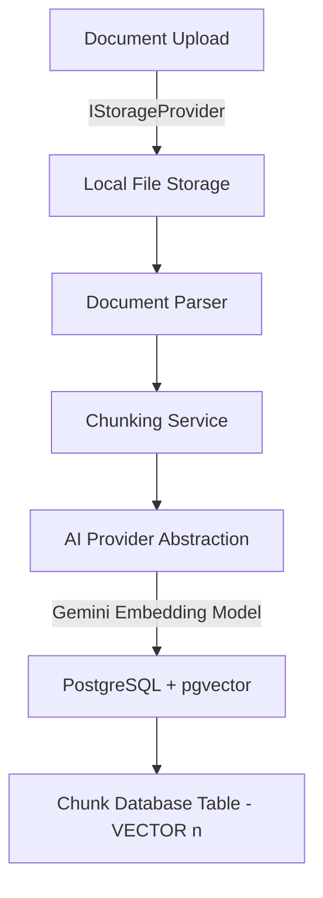
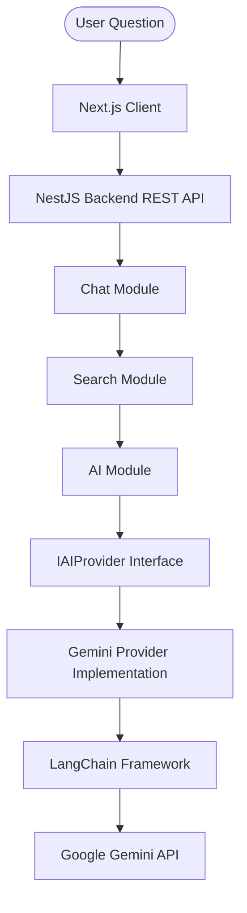

This architecture is governed by:

- [Product Requirements Specification](Product_Requirements_Specification.md)
- [Architecture Principles](Architecture_Principles.md)
- [Engineering Standards](Engineering_Standards.md)
- [System Architecture](System_Architecture.md)
- [Database Design](Database_Design.md)

These documents collectively define the EnterpriseIQ Version 1 RAG architecture.

---

# RAG Architecture Document

This document defines the Retrieval-Augmented Generation (RAG) architecture, pipeline execution flows, parsing configurations, chunking boundaries, prompt layouts, security defenses, and error mitigation strategies for **EnterpriseIQ**. It serves as the authoritative blueprint for Version 1 implementation.

---

## 1. Executive Summary

EnterpriseIQ relies on Retrieval-Augmented Generation (RAG) to provide secure, context-aware answers to user questions based on internal company documents.

While Large Language Models (LLMs) possess vast pre-trained knowledge, they lack awareness of internal organizational documents, are prone to hallucinating statements, and cannot enforce document security boundaries. Training or fine-tuning models on proprietary data is operationally expensive, lacks real-time updates, and makes access control enforcement impossible.

RAG resolves these limitations by separating model reasoning from the document storage layer:
1. **Context Grounding**: Relevant text chunks are dynamically retrieved and injected as prompt context for user questions.
2. **Access Control Filtering**: Documents are filtered at the database level, ensuring users only retrieve information they have permissions to read.
3. **Traceability**: Generates precise citations pointing to the source files, page coordinates, and chunk indices.

---

## 2. RAG Design Principles

* **Retrieval Before Generation**: The system must retrieve authorized context chunks before prompt completion; generating answers based purely on pre-trained LLM weights is prohibited.
* **Source Grounding**: All LLM outputs must be grounded strictly within the retrieved context chunks. If the answer is not present, the system must declare it is unable to answer.
* **Citation First**: Every statement returned to the user must cite the source document, page, and chunk index to prevent fabrications.
* **Hallucination Resistance**: Minimize the probability of incorrect facts by establishing strict system constraints and output guidelines.
* **Security by Design**: Permissions check and security filters are executed at the database retrieval layer, blocking unauthorized context leakage before prompt construction.
* **Provider Abstraction**: Core RAG workflows interact only with interfaces (`IAIProvider`). External model APIs (Google Gemini) and orchestration tools (LangChain) reside strictly within the Infrastructure Layer.
* **Modular AI Components**: Parsing, chunking, embedding, retrieval, prompt formatting, and completions operate as decoupled services.
* **Explainability**: Ingested prompts, retrieved context chunks, and token weights are logged to audit tables to enable full operation trace audits.
* **Context Minimization**: Limit context injection to high-relevance chunks to avoid context distraction ("lost in the middle" effect), control query latencies, and reduce API token costs.
* **Future Extensibility**: Pipelines are structured to support future upgrades (such as hybrid search, OCR, and cloud storage connectors) without modifying core business services.

---

## 3. High-Level RAG Architecture

The schemas below map the vertical execution flows for both document ingestion and semantic retrieval:

### 3.1. Ingestion Flow (Document to pgvector)


### 3.2. Retrieval Flow (Question to Response)


---

## 4. End-to-End RAG Pipeline

The RAG pipeline operates in two core phases: document ingestion and conversational retrieval.

### 4.1. Ingestion Phase Steps
1. **Document Upload**: Users upload raw document files (PDF, DOCX, TXT) through the web application.
2. **Validation**: The backend validates file format integrity, restricts sizes to under 50MB, and checks duplicate content hashes.
3. **Storage Provider**: Saves the file to Local Storage via the `IStorageProvider` interface, and initializes the document status as `Pending`.
4. **Text Extraction**: The parsing service extracts raw, clean text and updates the document status to `Processing`.
5. **Metadata Extraction**: Collects metadata tags (filename, upload date, uploaded by, department context, document tags, type hashes).
6. **Chunking**: Splits the extracted text into token-sized blocks with paragraph overlap.
7. **Embedding Generation**: Sends text segments batch-by-batch through the `IAIProvider` to calculate vector embeddings.
8. **Vector Storage**: Writes vectors, content, chunkIndex, tokenCount, characterCount, and metadata to the database table.
9. **Ready for Search**: Updates document status to `Completed`, indexing the document for search retrieval.

### 4.2. Retrieval Phase Steps
1. **User Question**: User submits a query string.
2. **Request Validation**: Auth Guard verifies JWT, checks rate limits, and sanitizes input.
3. **Conversation Context**: Gathers recent chat messages from the session to preserve conversational continuity.
4. **Embedding Generation**: Converts the question (combined with recent conversation summary if required) into a vector query embedding.
5. **Semantic Search**: Queries the `pgvector` database using the operator `<=>` (cosine distance).
6. **Permission Filter**: Filters query results on the database server using the user's role and department permissions.
7. **Context Builder**: Formats the authorized text chunks into a unified string.
8. **Prompt Builder**: Merges system instructions, conversation history, context string, and question into a prompt.
9. **Gemini Provider**: Dispatches prompt to the Gemini model using `IAIProvider`.
10. **Citation Builder**: Compares output text references with injected chunk metadata to resolve source links.
11. **Audit Logger**: Details (latency, response status, parameters, user details) are logged to the `audit_logs` table.
12. **Response**: Returns the finalized answer and citation payload to the web client.

---

## 5. Document Parsing Strategy

The parsing service converts raw document uploads into plain text formats, isolating clean document metadata and structural variables:

* **Supported File Types**:
  - `PDF`: Parses machine-readable layout text using standard PDF parsing libraries, tracking page divisions where available.
  - `DOCX`: Extracts text runs and structural elements using XML text extraction.
  - `TXT`: Ingests plain text logs directly.
* **Metadata Extraction**: Automatically captures filename, size, hash, upload date, and maps department boundaries based on the uploading user's department.
* **Duplicate Detection**: Calculates SHA-256 hash of document binary upon receipt, comparing it against the stored hash in the database to prevent duplicate ingestion.
* **Parser Responsibilities**: Clean formatting, strip unnecessary markup, identify page divisions (where possible, mapping page numbers for citation), and return clean text logs.
* **Limitations of Version 1**: Scanned images or scanned PDFs require OCR which is out of scope. Layouts are flattened into plain text (complex tables, diagrams, and formatting are not preserved).

---

## 6. Chunking Strategy

Dividing parsed text into smaller chunks is necessary to optimize retrieval:
* **Chunk Size**: Target token size (e.g. 500 characters or ~150-200 tokens) configured dynamically.
* **Chunk Overlap**: Target overlap (e.g. 10-20% of chunk size) to prevent contextual loss at chunk boundaries.
* **Paragraph Preservation**: Avoid splitting sentences in half; split chunks at natural paragraph boundaries where possible.
* **Metadata Association**: Each chunk carries its own copy of the parent document metadata in a JSONB field.
* **Chunk Indexing**: Sequentially numbers chunks (`chunkIndex`) to allow reconstruction of adjacent context.
* **Chunk Quality Considerations**: Balanced sizes (too small lacks context; too large dilutes information).
* **Why chunking matters**: Embeddings are calculated for chunks, not entire documents. Since LLMs have limited context windows and retrieval quality depends on targeted matches, dividing files into structured, semantic segments ensures similarity searches extract only relevant portions.

---

## 7. Metadata Strategy

Each chunk is stored in the database alongside its metadata, including:
- `documentId`: Parent document UUID reference.
- `filename`: Source file name.
- `pageNumber`: Target page number (where parsing is able to resolve page divisions).
- `section`: Nearest parent header string.
- `chunkIndex`: Incremental chunk index.
- `department`: Associated owner department.
- `uploadedBy`: User ID of uploader.
- `uploadDate`: Upload timestamp.
- `tags`: Admin-defined search tags.

**Why metadata improves retrieval and citations**: Allows database-level query filtering (only retrieve HR documents for HR employees) and provides all citation variables to map answers back to source file locations.

---

## 8. Embedding Strategy

* **Gemini Embeddings**: Version 1 uses Google Gemini API's `text-embedding-004` model to generate vector embeddings.
* **Embedding Provider Abstraction**: Generates vectors using the `IAIProvider` abstraction, ensuring that if model dimensions change or providers swap, only the infrastructure wrapper changes.
* **Embedding Generation Workflow**: Input text string -> dispatched to `IAIProvider` -> wrapper batches -> Google Gemini API -> returns `n`-dimensional vector array -> saved to database table.
* **Why embeddings are provider-independent**: The relational table stores vector values as `VECTOR(n)`. The application remains agnostic of dimensions, adjusting dynamically at the config layer.

---

## 9. Vector Storage

* **pgvector**: Stores vector embeddings in the `document_chunks` table using pgvector.
* **Index Configuration**: An HNSW index is configured on the `embedding` column of the `document_chunks` table, using Cosine Distance (`<=>`).
* **Relational Consistency**: Chunks are linked to their parent `Document` record. Deleting a document cascade-deletes all its chunks.
* **Search Integration**: The search module queries this table using similarity operators, while the AI Module reads text content to construct prompt context.

---

## 10. Query Processing Pipeline

When a user asks a question, the request is processed through the following pipeline:

```
User Question
    ↓
Request Validation (Auth Guard verifies JWT)
    ↓
Conversation Context (Loads recent chat history)
    ↓
Embedding Generation (Converts question into query vector)
    ↓
Semantic Search (Vector similarity query on pgvector)
    ↓
Permission Filter (Database join on DocumentPermissions)
    ↓
Context Builder (Formats retrieved chunks into context string)
    ↓
Prompt Builder (Constructs prompt using system template)
    ↓
Gemini Provider (Sends prompt to Gemini model)
    ↓
Citation Builder (Resolves document references)
    ↓
Audit Logger (Logs request metadata, latency, and status)
    ↓
Response (Finalized answer returned to client)
```

---

## 11. LangChain Architecture

LangChain is wrapped inside the `GeminiProvider` implementation block (Infrastructure Layer).

```
Application Layer
       ↓
IAIProvider Interface (Domain)
       ↓
Gemini Provider (Infrastructure Implementation)
       ↓
LangChain Integration
       ↓
Google Gemini API (External Model Service)
```

Key components utilized:
* **Document Loader**: Wraps local file reads.
* **Text Splitter**: Automates character/token-based chunking.
* **Embedding Wrapper**: Handles Gemini embedding API calls.
* **Retriever**: Orchestrates pgvector similarity query results.
* **Prompt Template**: Standardizes variable injection into system instructions.
* **Output Parser**: Facilitates parsing structured answers and citations.

**LangChain is an implementation detail**: Application services only interact with `IAIProvider` interfaces. Business logic must never import LangChain objects directly.

---

## 12. Prompt Construction

Prompts are constructed using structured layouts:

* **System Prompt**: Set system instructions (identity, constraints, behavior).
* **Retrieved Context**: Injected as a formatted block with distinct labels (e.g. `[DOC-1] File: X.pdf, Content: Y`).
* **Conversation History**: Appends recent chat logs to maintain context.
- **User Question**: The user's query is appended at the end.
- **Output Instructions**: Directs model to output answer in markdown and follow citation constraints.
- **Citation Rules**: Strict rule: "Every statement must reference context using [DOC-X] notations. Never cite a document not present in the context."
- **Hallucination Guard**: "If context does not contain the answer, reply only with: 'I am sorry, but the information requested is not available in the uploaded document database.'"

---

## 13. Citation Strategy

Citations must be fully grounded in metadata:
* The model outputs citations utilizing standard markers (e.g. `[DOC-X]`).
* The citation engine matches `[DOC-X]` with the actual document ID, filename, and page numbers from the retrieved chunks list.
* This maps claims to verified resources (filename, page, section).
* Never fabricate citations: if the chunk metadata is missing a page or segment, fall back to the filename level.

---

## 14. Conversation Memory

* **Chat Messages Persistence**: Every message in a thread is stored in the database.
* **Context Retrieval**: The Chat Module loads recent chat history (e.g., the last 5-10 messages) to feed into the prompt builder.
* **Context Truncation**: Older messages are truncated to protect the LLM context window.
* **Token Budget Management**: Tracks message length to ensure the total prompt size does not exceed the model's token limits or budget.

---

## 15. Hallucination Prevention

* **Strict Context Boundary**: System instructions explicitly forbid generating answers from pre-trained model weights.
* **Fallback Trigger**: If the search returns no matching chunks, the model defaults to the fallback answer: *"I am sorry, but the information requested is not available."*
* **Source Grounding**: All summaries and generation tasks must utilize facts contained within the provided context block.
* **Citation Verification**: The backend verifies citations, confirming that the document referenced in `[DOC-X]` matches a retrieved chunk.

---

## 16. Prompt Injection Defense

* **Fenced Blocks**: Prompts use special boundary markers (e.g. `<context>` and `<query>`) to separate user input from system instructions.
* **Input Sanitization**: Backend controllers strip potential exploit patterns and system instructions from incoming text inputs.
* **Access Filtering**: Since database-level permission filters restrict similarity search results, users cannot access unauthorized documents through prompt injection attacks.
* **Output Isolation**: Output parsers validate response syntax to ensure that the model has not leaked system templates.

---

## 17. Error Handling

* **File Parsing Failure**: If a file cannot be parsed, the system updates the document status to `Failed` and records the error in the database.
* **Embedding Failure**: Catch external model API errors; retry embedding generation using exponential backoff.
* **Gemini Timeout**: Fallback gracefully with user-visible errors and log failed audit logs.
* **Vector Search Failure**: Catch pgvector operational failures, logging traces to audit tables.
* **Database Failure**: Standard transaction rollbacks via Prisma.
* **Storage Failure**: Roll back file changes and document registry records.

---

## 18. Performance Optimization

* **Chunk Sizing**: Balanced at ~1000 characters to optimize density.
* **Token Budgeting**: Keep context blocks small (max 5-10 chunks).
* **Duplicate Detection**: Check SHA-256 hash before parsing.
* **Database Indexing**: HNSW index on the embedding vector column.
* **Streaming Responses**: Utilize Server-Sent Events (SSE) or streams to return tokens in real-time, reducing perceived latency.
* **Future Caching**: The API is designed to support future Redis caching of embedding vectors and prompt responses.

---

## 19. Future Evolution

The architecture is built to support future RAG upgrades:
* **OCR Ingestion**: Adding OCR involves introducing a layouts-aware parsing service in the document ingestion pipeline.
* **Hybrid Search**: PostgreSQL full-text search indexes can be added to the `content` column of `document_chunks`, merging semantic and keyword search.
* **Re-ranking**: A re-ranking service can be added to the query pipeline after semantic retrieval, scoring the top retrieved chunks before context building.
* **Additional AI Providers**: Support for other AI models can be introduced by writing new classes that implement `IAIProvider`.
* **Voice Chat**: Audio translation modules can be added at the controller layer without changing the RAG pipeline.
* **Connectors**: External document sources can be integrated by creating ingestion tasks that pull files and route them through the document service.
* **Multi-tenancy**: Tenancy context fields can be added to tables and query filters to support multi-tenancy.

---

## 20. RAG Architectural Decisions (ADRs)

### ADR-001: Use RAG
* **Decision**: Use Retrieval-Augmented Generation (RAG).
* **Reason**: Grounds LLM output in internal document context, ensuring factual correctness and enabling citations.
* **Trade-off**: Requires database storage and vector indexes, increasing operational complexity.

### ADR-002: Use LangChain
* **Decision**: Use LangChain within the Gemini integration layer.
* **Reason**: Simplifies chunking, text splitting, model prompts, and structured output formatting.
* **Trade-off**: Introduces an external dependency.

### ADR-003: Use Gemini
* **Decision**: Use Google Gemini as the LLM and embedding model.
* **Reason**: Generates accurate completions, offers rich context windows, and provides official Node.js SDK support.
* **Trade-off**: Binds completions to external API latency and quotas.

### ADR-004: Use pgvector
* **Decision**: Use PostgreSQL with the pgvector extension for storing and searching vector embeddings.
* **Reason**: Avoids the complexity of managing a separate vector database. Allows metadata filtering and similarity searches in a single SQL query.
* **Trade-off**: Lower throughput on scale compared to dedicated engines like Pinecone. This is acceptable for single-tenant workloads.

### ADR-005: Use Provider Abstraction
* **Decision**: Implement an AI Provider Abstraction (`IAIProvider`).
* **Reason**: Decouples application logic from Gemini API specifications, keeping the codebase future-proof.
* **Trade-off**: Introduces a minor abstraction layer overhead.

### ADR-006: Use Chunking
* **Decision**: Split documents into overlapping chunks.
* **Reason**: Optimizes retrieval density and manages LLM context window constraints.
* **Trade-off**: Requires careful tuning of chunk size and overlap parameters.

### ADR-007: Use Citations
* **Decision**: Force the LLM to output citations matching context keys.
* **Reason**: Enables source verification and prevents model hallucinations.
* **Trade-off**: Constrains response formats, increasing model reasoning load.

### ADR-008: Use Conversation Memory
* **Decision**: Store chat history and inject recent context in prompts.
* **Reason**: Preserves thread coherence in conversational multi-turn chats.
* **Trade-off**: Increases prompt payload sizes and API costs.

---

Document Status

Version: 1.0

Status: BASELINE APPROVED

Approved By

- Product Owner
- Software Architect

Related Documents

- [Product Requirements Specification](Product_Requirements_Specification.md)
- [Architecture Principles](Architecture_Principles.md)
- [Engineering Standards](Engineering_Standards.md)
- [System Architecture](System_Architecture.md)
- [Database Design](Database_Design.md)

-------------------------------------------------
