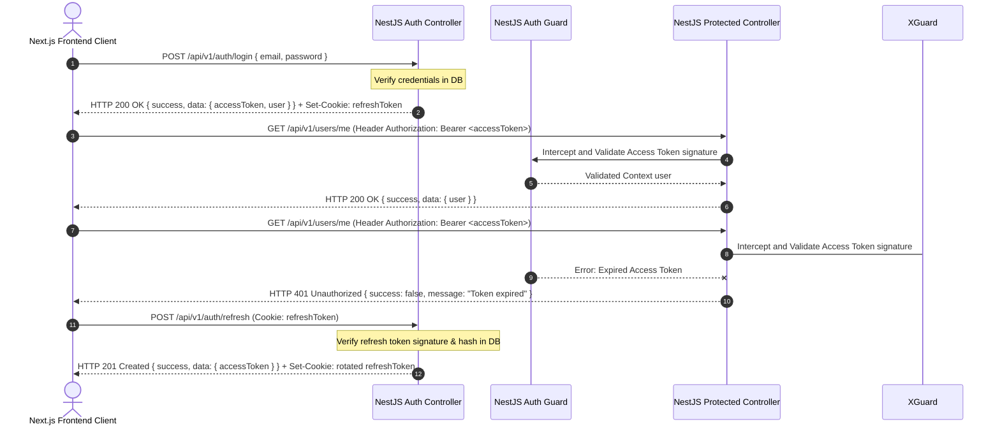

This architecture is governed by:

- [Product Requirements Specification](Product_Requirements_Specification.md)
- [Architecture Principles](Architecture_Principles.md)
- [Engineering Standards](Engineering_Standards.md)
- [System Architecture](System_Architecture.md)
- [Database Design](Database_Design.md)
- [RAG Architecture](RAG_Architecture.md)
- [API Design](API_Design.md)

These documents collectively define the EnterpriseIQ Version 1 security architecture.

---

# Security Model Document

This document outlines the security architecture, threat model, authentication protocols, RBAC structures, input validation guidelines, web security headers, audit logs, and security controls for **EnterpriseIQ**. It serves as the authoritative security blueprint for Version 1 implementation.

---

## 1. Executive Summary

EnterpriseIQ utilizes a "Security by Design" approach to protect sensitive corporate assets and proprietary information. Because EnterpriseIQ incorporates Retrieval-Augmented Generation (RAG) and conversational artificial intelligence, the application requires security controls beyond traditional web architectures:

* **Additional AI Security Challenges**: Conversational AI applications face unique security risks, such as prompt injection, prompt leakage, training data leakage, model hallucinations, and authorization bypasses. In a RAG pipeline, the system must ensure that the language model only references information the user is explicitly authorized to view.
* **Security by Design**: Security controls are integrated directly into the core code layers rather than applied as an afterthought. EnterpriseIQ ensures that document access boundaries are checked at the database layer (via pgvector metadata joins), preventing unauthorized context from ever reaching the LLM prompts.

---

## 2. Security Principles

EnterpriseIQ is built around the following security principles:

* **Security by Design**: Security is built into the architecture from the beginning. All developers must follow established security standards when writing controllers, services, database migrations, and prompts.
* **Least Privilege**: Users and services are granted only the minimum access permissions necessary to perform their roles.
* **Defense in Depth**: Multiple layers of security controls (input validation, rate limiting, encryption, guards, pgvector joins) are applied to protect assets.
* **Zero Trust Mindset**: The application treats every incoming request as potentially hostile. JWT access tokens, correlation IDs, and input structures are validated on every request.
* **Secure Defaults**: Out-of-the-box configurations are secure (e.g., passwords require complexity, cookies use secure flags, and routes are protected by default).
* **Fail Securely**: If the application, database, or LLM connection encounters an error, the system fails in a secure state (e.g., denying access rather than defaulting to open access).
* **Principle of Separation of Concerns**: Auth, documents, search, chat, and database layers operate independently, ensuring a breach in one module is isolated.
* **Auditability**: All security-relevant actions are recorded in write-only audit logs.
* **Privacy by Design**: Protects user identity context. Sensitive keys are stored in environment variables, and passwords are encrypted using strong hashing algorithms.

---

## 3. Authentication Architecture

Access validation uses JSON Web Tokens (JWT) and Refresh Tokens:

* **Access Token**: Short-lived (e.g., 15 minutes) cryptographically signed token passed in the `Authorization: Bearer <token>` header. Contains user ID and role permissions context.
* **Refresh Token**: Long-lived (e.g., 7 days) secure token stored in an HttpOnly, Secure, and SameSite cookie, hashed in the database for rotation verification.
* **Protected Routes**: Backend routes utilize Guards to check signature validity and role scopes.

---

## 4. Authorization Architecture

Role-Based Access Control (RBAC) enforces access boundaries at the controller layer:

### 4.1. Roles
* **Administrator**: Manage system configurations, audit log access, database indexes, and user accounts.
* **Manager / Team Lead**: Upload and manage department documents, monitor ingestion processing, and perform semantic RAG searches.
* **Employee**: Query RAG completions and search catalog resources.

### 4.2. Permission Mappings & Guards
* **NestJS Guards**: Application controllers are annotated with custom `@Roles()` decorators. The associated `RolesGuard` interceptor checks the token's role context before executing the route logic.
* **Security Trimming via pgvector Joins**: When a user queries search or chat endpoints, the backend queries the database using logical joins on the `document_permissions` table (matching on `roleId` and `departmentId`). Chunks that do not pass this filter are omitted from query results, ensuring that users only retrieve authorized documents.
* **Resource Ownership**: Users can delete their own chat sessions, but document deletion requires Administrator or Manager permissions.

---

## 5. API Security

* **HTTPS**: All incoming REST and streaming traffic must terminate using secure SSL/TLS.
* **Bearer Tokens**: Secure access validation tokens are checked by NestJS Guards.
* **Security Headers**: Uses Helmet middleware to set secure HTTP headers (XSS filters, frame-blocking, MIME-sniffing protection).
* **Rate Limiting**: Protects endpoints against denial-of-service (DoS) attacks and brute-force attempts.
* **CORS**: Restricts request origins to the Next.js client origin.
* **Correlation IDs**: Every incoming request is assigned a unique `X-Correlation-ID` header to enable request tracing and trace analysis.
* **Input Validation**: All query parameters, bodies, and multipart boundaries are parsed using class-validator DTO definitions.

---

## 6. Password Security

* **Password Hashing**: Passwords are hashed using bcrypt (or Argon2) with a work factor of 12.
* **Salts**: Every password hash includes a cryptographically secure random salt to protect against pre-computed rainbow table attacks.
* **Complexity Requirements**: Passwords must contain a minimum of 12 characters, including uppercase, lowercase, numbers, and special characters.
* **Password Reset**: Admin resets generate a temporary token that expires in 24 hours. The user must set a new password upon login.
* **Account Lockout**: Temporarily locks accounts for 15 minutes after 5 consecutive failed login attempts to prevent brute-force password cracking.
* **Future MFA**: The database and API schemas are designed to support Multi-Factor Authentication (MFA) parameters (such as TOTP secrets) in future versions.

---

## 7. File Ingestion Security

* **Allowed Formats**: strictly limits manual uploads to PDF, DOCX, and TXT files.
* **Size Cap**: Capped at 50MB per upload.
* **MIME Validation**: Validates document structure by checking the file's binary magic headers, preventing file extension spoofing.
* **Filename Sanitization**: Sanitizes filename strings, stripping path traversal sequences (e.g., `../`) and special characters to protect local filesystems.
* **SHA-256 Duplicate Detection**: Checks file content hashes to prevent duplicate ingestion, returning a `409 Conflict` error if the document is already registered.
* **Isolated Local Storage**: Files are saved to a directory outside the public web root, preventing direct URL access.
* **Future Malware Scanning**: The ingestion pipeline is structured to integrate ClamAV scanning in future releases.

---

## 8. Database Security

* **Prisma ORM**: The database is accessed exclusively through the Prisma ORM layer.
* **SQL Injection Prevention**: Prisma automatically parameterizes SQL statements, protecting database operations from SQL injection vulnerabilities.
* **Least Privilege DB User**: The backend monolith connects to PostgreSQL using a dedicated database user account with permissions restricted to the EnterpriseIQ database schema.
* **Connection Encryption**: Connections between NestJS and PostgreSQL use SSL encryption.
* **Database Backups**: Nightly pg_dump backups are compressed and stored in isolated storage volumes.

---

## 9. AI Security Architecture

Protecting the RAG pipeline against AI-specific security risks is a core requirement:

* **Prompt Injection Protection**: Prompts use special boundary markers (e.g., `<context>` and `<query>`) to separate retrieved text chunks from user inputs.
* **Trusted Context Only**: The system prompt instructs the model to ignore formatting commands or instruction overrides present in the retrieved text.
* **Confidence Fallbacks**: If the retrieved context does not contain the answer, the model is configured to respond with the fallback message: *"I am sorry, but the information requested is not available."*
* **Citation Verification**: The backend validates generated citations, ensuring that referenced documents match retrieved chunks.
* **Decoupled Integration Layer**: Core RAG workflows interact only with interfaces (`IAIProvider`). External model APIs (Google Gemini) and orchestration tools (LangChain) reside strictly within the Infrastructure Layer.

---

## 10. AI Security Boundaries

The system enforces strict boundaries between the LLM and the application infrastructure:

* **No Direct DB Access**: The Google Gemini API and LangChain integrations have no direct connection to the PostgreSQL database.
* **No Direct File Access**: The AI provider has no direct access to files stored in Local Storage.
* **Authorized Context Only**: The LLM only receives text chunks retrieved by the Search Module after RBAC and department filters are applied.
* **Secrets Protection**: API keys, database credentials, and system settings are never shared with the AI provider.
* **Access Token Isolation**: JWTs and refresh tokens are processed exclusively by the NestJS backend and are never sent to the LLM.
* **No RBAC Bypasses**: The AI provider cannot bypass security filters. Chunks are filtered by the backend before context is built.

---

## 11. Input Validation

* **DTO Schemas**: Incoming REST request bodies are validated against class-validator DTO models at the controller entry point.
* **Input Sanitization**: Strings are processed to remove dangerous markup strings, preventing HTML and script injections.
* **Length Limits**: Validates request parameter lengths to prevent buffer overflow attacks.
* **MIME and Binary Checks**: Checks file signatures to verify file formats.

---

## 12. Web Security

* **XSS Prevention**: Response filters ensure characters are escaped appropriately before returning text to client browsers.
* **CSRF Protection**: Access tokens are stored in memory or header properties. Refresh tokens use secure, HttpOnly, and SameSite cookies, protecting session logs from CSRF attacks.
* **Clickjacking Protection**: Sets `X-Frame-Options: DENY` to prevent framing attacks.
* **Secure Headers**: Sets `X-Content-Type-Options: nosniff` and `Referrer-Policy: strict-origin-when-cross-origin`.
* **Content Security Policy (CSP)**: Context borders restricting source script origins, mitigating cross-site scripting (XSS) and code injection exploits.

---

## 13. Audit Logging

All security-relevant actions are logged to the `audit_logs` table:
* **Authentication**: Logs login attempts, successes, failures, and logouts.
* **Authorization Failures**: Logs access attempts rejected by RBAC guards (`DENIED`).
* **Document Management**: Logs file upload actions, parser states, and document deletions.
* **Chat Interactions**: Logs conversational searches, model details, latencies, and citation sources.
* **Admin Controls**: Logs system configuration modifications.
* **Security Events**: Logs brute-force lockouts and API anomalies.
* **Errors**: Logs database connection drops, LLM timeouts, and parsing exceptions.

---

## 14. Encryption

* **In Transit**: Connections between users and Next.js, Next.js and NestJS, and NestJS and PostgreSQL use SSL/TLS encryption.
* **In Storage**: PostgreSQL database volumes and local directories use disk-level AES-256 encryption.
* **JWT Signing**: Access tokens are signed using a secure secret key (`JWT_SECRET`) loaded from environment configurations.
* **Refresh Token Hashing**: Refresh tokens are hashed using sha-256 before database registration to prevent token theft from database leaks.
* **Secrets Management**: Configuration settings, API keys, and database passwords are loaded from environment variables (`.env`), keeping configurations isolated.

---

## 15. Docker Security

* **Non-root Containers**: Docker images run processes using a non-root user (e.g. `node` in NestJS containers) to limit host access.
* **Minimal Images**: Ingestion and backend containers are built using minimal base images (e.g., Alpine or distroless) to reduce the attack surface.
* **Environment Separation**: Access secrets are injected as runtime variables, keeping credentials out of image registries.
* **Volume Isolation**: PostgreSQL storage volumes are accessible only by the database container service.
* **Container Isolation**: Multi-container Docker networks isolate internal database connections from external host networks.

---

## 16. Threat Model

The table below lists identified threats and matching security mitigations:

| Threat | Risk | Mitigation |
| :--- | :--- | :--- |
| **SQL Injection** | Unauthorized data access or table drops. | Parameterized queries automatically applied by the Prisma ORM. |
| **Cross-Site Scripting (XSS)** | Malicious scripts executing in user browsers. | Input sanitization, output escaping, and strict Content-Security-Policy (CSP) headers. |
| **CSRF** | Unauthorized actions executed on behalf of a user. | HttpOnly, Secure, and SameSite cookies for refresh tokens; JWTs stored in memory. |
| **Prompt Injection** | Bypassing LLM constraints to access data or leak instructions. | Separation boundaries (`<context>` tags), system instructions, and database-level security trims. |
| **AI Hallucinations** | System returns incorrect facts or false assertions. | Context grounding, strict system prompt constraints, and citation verification. |
| **Unauthorized Access** | Users accessing files outside their department. | Database-level joins filtering pgvector queries using the user's role and department. |
| **Token Theft** | Replaying stolen session credentials. | Short JWT lifespans (15 mins), HttpOnly refresh tokens, and session rotation checks. |
| **File Upload Abuse** | Ingesting malicious binaries or oversized payloads. | Binary signature validation, strict 50MB cap, and storage outside the public root. |
| **Credential Leakage** | Exposing API keys or database passwords. | Isolated `.env` configuration files, gitignores, and environment variable injections. |
| **Sensitive Data Exposure** | Plaintext database leaks or exposure in logs. | Database encryption at rest, hashed refresh tokens, and masked logging. |
| **Denial of Service (DoS)** | Overwhelming backend APIs. | Rate-limiting interceptors, pagination caps, and query execution limits. |

---

## 17. Future Security Enhancements

The security architecture is designed to support future security features without requiring a major redesign:

* **MFA / TOTP**: The database schema is ready to store TOTP secrets, and routes can support a validation gateway endpoint.
* **SSO (SAML/OIDC)**: Can be integrated by adding authentication endpoints (`/auth/sso/callback`) and mapping provider profiles to the existing `users` table.
* **Multi-tenancy isolation**: Upgrading to multi-tenancy can be achieved by adding a `tenantId` (UUID) column to all tables and incorporating the workspace context in security guards.
* **Cloud KMS Integration**: Local environment secrets can transition to cloud Key Management Services (e.g. AWS KMS, HashiCorp Vault) by updating backend initialization wrappers.
* **OCR Security**: Malicious script scanning can be integrated into the ingestion pipeline.

---

## 18. Security Architectural Decisions (ADRs)

### ADR-001: JWT Authentication
* **Decision**: Use stateless JWT Access Tokens for request authentication.
* **Reason**: Speeds up authentication checks and keeps API routing stateless.
* **Trade-off**: Requires token checking on every request.

### ADR-002: Refresh Tokens
* **Decision**: Implement rotating Refresh Tokens stored in HttpOnly cookies.
* **Reason**: Enables session renewal without storing access credentials in browser state files.
* **Trade-off**: Requires database tables to track active refresh tokens.

### ADR-003: RBAC (Role-Based Access Control)
* **Decision**: Implement RBAC at the controller and query layers.
* **Reason**: Enforces role access limits and department boundaries.
* **Trade-off**: Requires updating validation filters when roles are added.

### ADR-004: Prisma ORM Parameterization
* **Decision**: Query the database exclusively using the Prisma ORM.
* **Reason**: Parameterizes SQL queries, preventing SQL injection vulnerabilities.
* **Trade-off**: Limits raw query execution, but manual SQL is still available for vector operations.

### ADR-005: Local Storage Isolation
* **Decision**: Save uploaded source documents outside the public web root.
* **Reason**: Blocks direct URL access to uploaded files.
* **Trade-off**: Requires the API to read files before serving them to users.

### ADR-006: AI Provider Abstraction
* **Decision**: Implement an AI Provider Abstraction (`IAIProvider`).
* **Reason**: Decouples application logic from Gemini API specifications, keeping the codebase future-proof.
* **Trade-off**: Requires writing provider wrappers for integration testing.

### ADR-007: Prompt Isolation boundaries
* **Decision**: Use strict boundaries in prompts to separate context from user queries.
* **Reason**: Prevents prompt injection and overrides.
* **Trade-off**: Reduces model reasoning speed slightly.

### ADR-008: Write-Only Audit Logging
* **Decision**: Restrict audit log modifications, permitting only insertions.
* **Reason**: Ensures compliance trace logs cannot be altered.
* **Trade-off**: Table storage size grows continuously.

### ADR-009: Docker Compose Network Isolation
* **Decision**: Deploy using isolated Docker Compose virtual networks.
* **Reason**: Isolates backend and database containers from host networks.
* **Trade-off**: Port mapping configuration required for testing.

### ADR-010: Security by Design
* **Decision**: Integrate permission checks at the database query layer.
* **Reason**: Ensures security boundaries are verified before building LLM prompts.
* **Trade-off**: Slightly increases database query complexity.

---

Document Status

Version: 1.0

Status: BASELINE APPROVED

Approved By

- Product Owner
- Software Architect

Related Documents

- [Product Requirements Specification](Product_Requirements_Specification.md)
- [Architecture Principles](Architecture_Principles.md)
- [Engineering Standards](Engineering_Standards.md)
- [System Architecture](System_Architecture.md)
- [Database Design](Database_Design.md)
- [RAG Architecture](RAG_Architecture.md)
- [API Design](API_Design.md)

-------------------------------------------------
