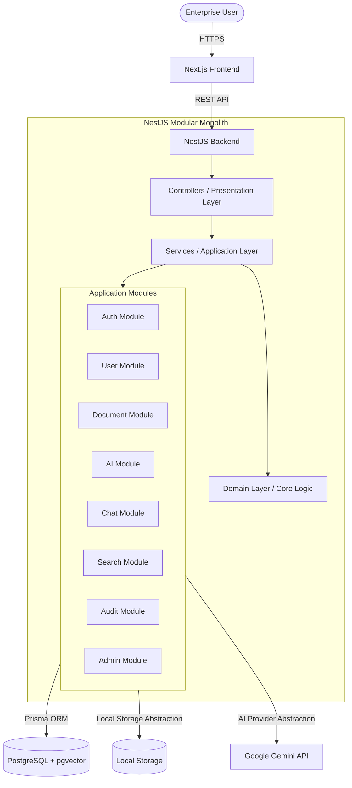
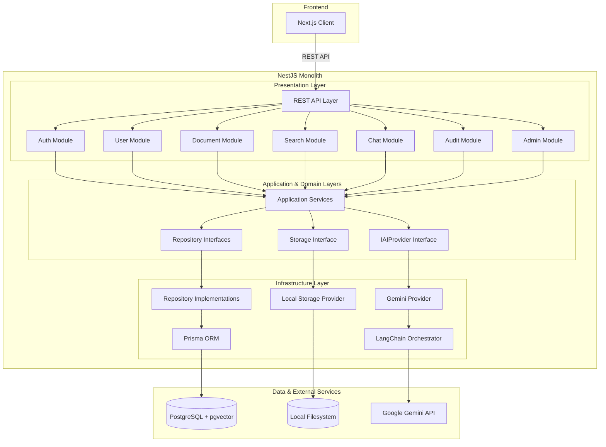
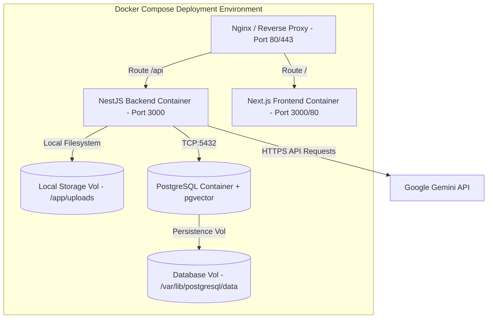

This architecture is governed by:

- [Product Requirements Specification](Product_Requirements_Specification.md)
- [Architecture Principles](Architecture_Principles.md)
- [Engineering Standards](Engineering_Standards.md)

These documents collectively define the EnterpriseIQ Version 1 architecture.

---

# System Architecture Document

This document defines the high-level system architecture, design patterns, component topology, and execution flows for **EnterpriseIQ**. It serves as the authoritative technical blueprint for Version 1 implementation.

---

## 1. Executive Summary
EnterpriseIQ is an Enterprise AI Knowledge Intelligence Platform that centralizes organizational knowledge and enables employees to securely search, understand, and interact with enterprise information using conversational AI.

The platform is designed as a single-tenant Modular Monolith for Version 1, leveraging NestJS on the backend and Next.js on the frontend. Core application state and vector embeddings are stored in a PostgreSQL database using the `pgvector` extension. Ingested files are stored on the local file system using a dedicated Storage Abstraction layer to ensure future cloud service readiness. The architecture prioritizes separation of concerns, compile-time dependency injection, and security by design, utilizing JSON Web Tokens (JWT) and Role-Based Access Control (RBAC) to enforce security boundaries.

---

## 2. Architectural Style

* **Modular Monolith instead of Microservices**: EnterpriseIQ Version 1 is built as a Modular Monolith. Microservices introduce premature complexity, including network latency, distributed state management, and operational overhead. A Modular Monolith keeps deployment simple—running in a single backend container—while maintaining clean boundary separation. This allows modules to be easily extracted into independent microservices in the future if scalability requirements demand it.
* **Clean Architecture**: By partitioning the codebase into distinct layers (Presentation, Application, Domain, and Infrastructure), business logic remains isolated and independent of databases, user interfaces, and external AI providers. This ensures the core product logic can be easily tested in isolation.
* **REST APIs**: Communication between the Next.js frontend client and the NestJS backend utilizes a REST API. REST provides standard HTTP verbs, stateless request handling, and compatibility with rate limiters and auth filters.

---

## 3. High-Level Architecture Diagram



---

## 4. Component Architecture

The component architecture details the system layers, showcasing the vertical division between application modules, domain boundaries, repository interfaces, and implementation providers.



---

## 5. Layered Architecture

EnterpriseIQ enforces a layered architecture following Clean Architecture rules. Dependencies point inward: outer layers depend on inner layers, but inner layers remain agnostic of outer layers.

* **Presentation Layer**: Exposes endpoints and interface boundaries to clients. Responsibilities include parsing incoming HTTP requests, executing DTO validation, verifying route guards, and formatting outgoing JSON responses.
* **Application Layer**: Contains application-specific business logic. It orchestrates user workflows by coordinating Domain entities and calling Infrastructure abstractions (such as repository interfaces or storage providers).
* **Domain Layer**: The core of the system, completely decoupled from frameworks and external libraries. It contains the business entities, domain models, and repository interface definitions (contracts) describing system behavior.
* **Infrastructure Layer**: Implements the contracts defined by inner layers. Responsibilities include database operations (using Prisma ORM mapping to PostgreSQL), filesystem operations, and third-party API service calls (such as Google Gemini).

### 5.1. The Repository Layer Abstraction
To keep the application services completely decoupled from ORM-specific logic and schema changes, the system incorporates a strict **Repository Pattern**:

```
Controller
    ↓
Application Service
    ↓
Repository Interface (Domain Layer)
    ↓
Repository Implementation (Infrastructure Layer)
    ↓
Prisma ORM
    ↓
PostgreSQL
```

* **Why Repository abstractions improve maintainability**: By hiding Prisma schemas and direct database operations behind repository interfaces, application services stay independent of database details. If the underlying schema, ORM queries, or storage engines shift, only the Infrastructure implementation class is edited; the application business logic remains untouched.
* **Why Repository abstractions improve testability**: Repository interfaces facilitate compile-time mocking. Unit tests can execute business workflows by passing stubbed mock repository classes rather than connecting to a physical database instance. This keeps testing quick and decoupled.

---

## 6. Dependency Rules

To enforce Clean Architecture boundaries, EnterpriseIQ defines strict dependency rules:

```
[Presentation Layer] ────→ [Application Layer] ────→ [Domain Layer] ←──── [Infrastructure Layer]
```

### 6.1. Allowed Dependencies
* **Presentation to Application**: Controllers are allowed to inject Application Services.
* **Application to Domain**: Services interact directly with Domain entities, domain utilities, and interface contracts.
* **Infrastructure to Domain**: Database adapters, external API wrappers, and storage providers must implement Domain interface contracts.

### 6.2. Forbidden Dependencies
* **Infrastructure to Presentation**: Low-level database classes or external clients must never import controllers, DTOs, or presentation routes.
* **Application to Controllers**: Business logic must never import controller logic or HTTP-dependent context.
* **Domain to Frameworks**: Domain objects must remain pure TypeScript; they must never import NestJS libraries, Prisma clients, or external API drivers.
* **Business Logic to Prisma**: Application services must never run Prisma queries or import the Prisma client directly.
* **Business Logic to Gemini / LangChain**: The application layer must never import Google Gemini libraries, LangChain utilities, or downstream AI configurations.

These rules ensure framework implementations remain on the periphery. Leaking database schemas or third-party API layouts into the core application logic creates brittle codebases, which these boundaries prevent.

---

## 7. Cross-Cutting Concerns

Cross-cutting concerns are system-wide policies implemented consistently across all modules:

* **Authentication**: Secures endpoints by verifying the signatures and expiration parameters of JSON Web Tokens (JWT) and Refresh Tokens.
* **Authorization**: Restricts resource access by evaluating user roles (Administrator, Manager / Team Lead, Employee) against defined permissions using guards.
* **Input Validation**: Sanitizes and validates request bodies using class-validator DTO check structures before they reach application services.
* **Logging**: Records operational events, debug traces, and system activity using structured JSON formats.
* **Exception Handling**: Translates runtime execution failures into uniform, user-friendly HTTP error structures using global exception filters.
* **Configuration Management**: Manages runtime parameters and system configurations using a centralized configuration service.
* **Dependency Injection**: Resolves component graphs at launch using compile-time NestJS dependency injection mechanisms.
* **Audit Logging**: Automatically records query parameters, permissions, user context details, and latency variables to persistent database records.
* **Rate Limiting**: Restricts the volume of concurrent requests from individual IP addresses to prevent server overload.

---

## 8. Module Architecture

The NestJS backend application is structured into clean modules that group related business capabilities.

### 8.1. Auth Module
* **Purpose**: Manages user authentication, token issuance, and validation.
* **Responsibilities**: Authenticates credentials, issues short-lived JWT Access Tokens and secure Refresh Tokens, and verifies token signatures on inbound requests.
* **Dependencies**: `User Module`, `Audit Module`.
* **Public Interfaces**: `IAuthService` (methods: `login()`, `refreshTokens()`, `validateUser()`).

### 8.2. User Module
* **Purpose**: Manages user accounts, profiles, and credentials.
* **Responsibilities**: Creates, updates, and retrieves user accounts, manages user password hashing, and stores role permissions.
* **Dependencies**: `Audit Module`.
* **Public Interfaces**: `IUserService` (methods: `createUser()`, `findUserById()`, `findUserByEmail()`, `updateUserRole()`).

### 8.3. Document Module
* **Purpose**: Coordinates document uploads, metadata extraction, and ingestion status.
* **Responsibilities**: Receives local file uploads (PDF, DOCX, TXT), validates document boundaries, saves files, parses text, and tracks ingestion status (`Pending`, `Processing`, `Completed`, `Failed`).
* **Dependencies**: `AI Module`, `Audit Module`.
* **Public Interfaces**: `IDocumentService` (methods: `uploadDocument()`, `listDocuments()`, `deleteDocument()`, `getDocumentStatus()`).

### 8.4. AI Module
* **Purpose**: Provides a unified interface for interacting with Large Language Models.
* **Responsibilities**: Interacts with the AI Provider Abstraction layer to generate text completions and generate vector embeddings.
* **Dependencies**: None.
* **Public Interfaces**: `IAIService` (methods: `generateCompletion()`, `generateEmbeddings()`).

### 8.5. Chat Module
* **Purpose**: Orchestrates RAG conversational sessions.
* **Responsibilities**: Manages conversation history, constructs context-rich prompts containing retrieved document chunks, requests LLM responses, and formats citations.
* **Dependencies**: `Search Module`, `AI Module`, `Audit Module`.
* **Public Interfaces**: `IChatService` (methods: `sendMessage()`, `getChatHistory()`, `clearChat()`).

### 8.6. Search Module
* **Purpose**: Handles semantic retrieval.
* **Responsibilities**: Converts natural language queries into embeddings and searches the `pgvector` database utilizing ACL security filters.
* **Dependencies**: `AI Module`.
* **Public Interfaces**: `ISearchService` (methods: `searchSimilarChunks()`).

### 8.7. Audit Module
* **Purpose**: Tracks platform queries and administrative modifications for compliance audits.
* **Responsibilities**: Logs user IDs, model actions, response latencies, errors, and authorization checks to a persistent table.
* **Dependencies**: None.
* **Public Interfaces**: `IAuditService` (methods: `logEvent()`).

### 8.8. Admin Module
* **Purpose**: Provides administrative control interfaces.
* **Responsibilities**: Manages system environment configurations and exposes system-wide audit logs.
* **Dependencies**: `User Module`, `Document Module`, `Audit Module`.
* **Public Interfaces**: `IAdminService` (methods: `getSystemConfig()`, `getAuditLogs()`).

---

## 9. Request Flow

The sequence below describes the flow of a standard REST API query through the system:

```
Browser
  ↓ (HTTP Request + JWT Bearer Token)
Next.js Routing
  ↓ (API request dispatch)
REST API Endpoint
  ↓ (NestJS CORS & Rate Limiter validation)
Controller (Presentation Layer)
  ↓ (DTO validation via class-validator & Guard signature verification)
Service (Application Layer)
  ↓ (Business logic execution)
Repository (Infrastructure Layer)
  ↓ (Database operation query call)
Prisma ORM
  ↓ (SQL query mapping execution)
PostgreSQL Database
  ↓ (Data response payload return)
Prisma Client
  ↓ (TypeScript Entity mapping)
Service Response
  ↓ (JSON mapping serialization)
HTTP Response
```

---

## 10. Authentication Flow

Authentication secures access to platform features using JWTs and Refresh Tokens:

1. **Login**: User submits username and password to `/api/auth/login`.
2. **JWT Issuance**: On successful credential validation, the Auth Module returns a short-lived JWT Access Token in the response body.
3. **Refresh Token Cookie**: Simultaneously, a cryptographically secure Refresh Token is issued and stored in the user's browser using an HttpOnly, Secure, and SameSite cookie.
4. **Protected Route Access**: When querying API endpoints, the frontend client includes the Access Token in the `Authorization: Bearer <token>` header.
5. **Route Interception**: NestJS Auth Guards verify the token signature, validate expiration, and inject the authenticated user payload into the request execution context.
6. **Token Refresh**: When the Access Token expires, the client calls `/api/auth/refresh` containing the HTTP-only cookie. A new Access Token is returned, maintaining a secure user session.

---

## 11. Document Processing Flow

Ingested documents are split, embedded, and indexed for semantic searches:

```
Upload ──→ Validation ──→ Storage ──→ Text Extraction ──→ Metadata Extraction ──→ Chunking
                                                                              ↓
Completed ←── Status Update ←── Vector Storage ←── Embedding Generation ←─────┘
```

* **Upload**: The administrator or Manager / Team Lead uploads a PDF, DOCX, or TXT file through the web application client.
* **Validation**: The upload controller verifies file headers, restricts sizes to under 50MB, and ensures the content hash is unique (duplicate prevention).
* **Storage**: The binary file is written to the local disk using the Storage Abstraction layer, and a database document record is created with status `Pending`.
* **Text Extraction**: The document parser extracts raw, unformatted text from the stored file, updating status to `Processing`.
* **Metadata Extraction**: Extends metadata tags to capture filename, upload date, uploaded by, department context, document tags, and type hashes.
* **Chunking**: The extracted text is divided into consistent text chunks based on character length with a designated overlap.
* **Embedding Generation**: Chunks are processed through the AI Provider abstraction layer to generate vector representations using Google's Gemini embedding model.
* **Vector Storage**: Persists the embeddings, text payloads, and ACL metadata parameters to the database table.
* **Status Update**: Modifies the document ingestion registry state in PostgreSQL to `Completed`.
* **Completed**: The document is flagged as ready for semantic search query retrieval.

---

## 12. RAG Flow

The Retrieval-Augmented Generation (RAG) workflow coordinates retrieval and generation:

```
Question
   ↓
Request Validation
   ↓
Query Embedding
   ↓
Semantic Retrieval ──→ Permission Filtering (RBAC) ──→ Context Builder ──→ Prompt Builder
                                                                               ↓
Response ←── Citation Builder ←── Audit Logger ←── Gemini Provider ←───────────┘
```

* **Question**: The Employee inputs a search question into the web application client.
* **Request Validation**: Auth Guards check user JWT access signatures, block empty requests, and validate inputs.
* **Query Embedding**: The query text is converted into a vector embedding using Google's Gemini embedding model.
* **Semantic Retrieval**: A vector similarity query (`<=>` cosine operator) is run against the PostgreSQL vector index.
* **Permission Filtering (RBAC)**: Checks user permissions against vector Access Control Metadata tags, ensuring they only retrieve authorized content.
* **Context Builder**: Formats matching chunks into organized, readable variables.
* **Prompt Builder**: Merges context variables, search parameters, conversation history, and system instructions into a unified prompt.
* **Gemini Provider**: Dispatches the prompt through the AI Provider abstraction layer to Google's Gemini API.
* **Citation Builder**: Compares generated text assertions with source chunk metadata, formatting precise citations (filenames and source locations).
* **Audit Logger**: Details of the transaction (User ID, retrieved document IDs, model parameters, and response latency) are recorded in the audit logs.
* **Response**: The structured response and citations are returned to the user.

---

## 13. Data Storage Architecture

EnterpriseIQ decouples data storage logic from business services using abstractions.

```
Document Module (Application Layer)
       ↓
Storage Interface (Domain Layer)
       ↓
Local Storage Provider (Infrastructure Layer)
```

* **Storage Provider Abstraction**: Core modules communicate with storage services through the `IStorageProvider` interface. The `LocalStorageProvider` implements this interface, managing writes to the local file system. If cloud services are introduced later, a new provider class is implemented without changing the application logic:
  * **Local Storage Provider** (Version 1 target)
  * **AWS S3 Provider** (Future)
  * **Azure Blob Provider** (Future)
  * **Google Cloud Storage Provider** (Future)
  * **MinIO Provider** (Future)
* **PostgreSQL**: Serves as the primary operational database, storing relational structures (users, roles, permissions, document ingestion metadata, and audit logs).
* **pgvector**: Implements native vector operations directly inside PostgreSQL. Vector embeddings are stored in a column side-by-side with relational metadata, allowing high-performance similarity searches combined with SQL RBAC filters.

---

## 14. AI Architecture

Business logic remains independent of the specific AI provider:

```
Application Layer
       ↓
IAIProvider Interface (Domain)
       ↓
Gemini Provider (Infrastructure Implementation)
       ↓
LangChain Integration
       ↓
Google Gemini API (External Model Service)
```

The system depends on an abstraction interface (`IAIProvider`) defined in the domain layer. The backend injects the `GeminiProvider` class implementing this interface. LangChain is utilized inside the provider to handle document loading, chunking, retrieval orchestration, and prompt construction. **LangChain is an implementation detail** of the provider. Business logic must never depend directly on LangChain or Gemini. If the model provider is changed, a new provider class is implemented without modifying the core business logic.

---

## 15. Security Architecture

* **JWT & Refresh Tokens**: Employs stateless token pairs, combining access tokens in request headers with rotate-and-revoke refresh tokens in HTTP-only, secure cookies.
* **RBAC Enforcement**: Restricts controller route access based on Roles (Administrator, Manager / Team Lead, Employee). Permissions are checked using NestJS guards.
* **Input Validation**: All incoming requests are validated against DTO schemas using class-validators, blocking execution on formatting errors.
* **Rate Limiting**: Protects API interfaces against denial-of-service and brute force attempts using IP-based request limits.
* **Audit Logging**: Keeps an audit log of every query trace, user ID, accessed chunk ID, model configuration, and validation error.
* **Secure File Upload**: Limits file sizes to 50MB, validates file extensions, and stores files outside the public directory.

---

## 16. Deployment Architecture



This simple setup uses Docker Compose to deploy the system as three services (Next.js client, NestJS server, and PostgreSQL database), keeping hosting costs low and simplifying deployment for Version 1.

---

## 17. Future Evolution

The architecture is built to accommodate future extensions without requiring a redesign:

* **Multi-tenancy**: The database schema and search structures are prepared for tenancy separation. Upgrading to multi-tenancy requires adding a `tenantId` field to PostgreSQL tables and passing it as a filter condition (`WHERE tenantId = :tenantId`) in similarity queries.
* **OCR Ingestion**: Adding OCR support involves registering an external document parsing microservice in the Ingestion workflow. The parsing engine will identify scanned documents and route them through the OCR processor prior to chunking.
* **Connectors (SharePoint, GitHub, Google Drive)**: Additional ingestion sources can be registered as ingestion services. These services download documents using API calls and pass the raw files to the existing `IDocumentService.uploadDocument` interface.
* **Single Sign-On (SSO)**: SSO integration (SAML 2.0 or OIDC) can be added to the Auth Module by introducing alternative Passport strategies. The Auth Module validates identity assertions and returns standard JWT Access/Refresh tokens.
* **Additional AI Providers**: Support for other AI models can be introduced by writing new classes that implement `IAIProvider` and updating the dependency injection configuration.

---

## 18. Architectural Decisions

### ADR-001: Use Modular Monolith
* **Decision**: Build EnterpriseIQ as a Modular Monolith.
* **Reason**: Simplifies development velocity, testing pipelines, and deployment for Version 1. Avoids the operational overhead of microservices.
* **Trade-off**: High coupling if boundaries are not maintained. This is strictly mitigated using NestJS module boundaries and clean layered imports.

### ADR-002: PostgreSQL + pgvector
* **Decision**: Use PostgreSQL with `pgvector` for database storage and vector embeddings.
* **Reason**: Combines relational metadata and vector embeddings in a single database instance, allowing similarity queries and ACL joins in a single SQL operation.
* **Trade-off**: Lower search throughput under extremely large datasets compared to dedicated vector databases. This is acceptable for V1 single-tenant installations.

### ADR-003: LangChain for Ingestion & Prompts
* **Decision**: Use LangChain within the AI integration layer.
* **Reason**: Provides clean abstractions for loading documents, chunking text, constructing prompts, and formatting model responses.
* **Trade-off**: Introduces external dependencies. This is mitigated by isolating LangChain imports within the AI module.

### ADR-004: NestJS Framework
* **Decision**: Build the backend using NestJS.
* **Reason**: Provides structured routing, dependency injection, and security guards out of the box, facilitating Clean Architecture implementation.
* **Trade-off**: Higher framework learning curve than simple Express apps.

### ADR-005: Next.js Framework
* **Decision**: Build the frontend using Next.js.
* **Reason**: Highly responsive React pages, native route structures, and fast development speed.
* **Trade-off**: Framework updates must be managed, but Next.js has an active community.

### ADR-006: Docker Compose Deployment
* **Decision**: Package and deploy applications using Docker Compose.
* **Reason**: Simplifies runtime container configurations for V1 without the complexity of Kubernetes orchestration.
* **Trade-off**: Lacks native horizontal scaling and automated failover capabilities.

### ADR-007: Local Storage
* **Decision**: Store uploaded source documents on the local filesystem.
* **Reason**: Simplifies deployment and reduces dependency on external cloud providers.
* **Trade-off**: Limits horizontal scalability. This is mitigated by isolating disk writes behind a Storage Abstraction interface.

### ADR-008: AI Provider Abstraction
* **Decision**: Implement an AI Provider Abstraction (`IAIProvider`).
* **Reason**: Decouples application logic from Gemini API specifications, keeping the codebase future-proof.
* **Trade-off**: Introduces a minor abstraction layer overhead.

---

Document Status

Version: 1.0

Status: BASELINE APPROVED

Approved By

- Product Owner
- Software Architect

Related Documents

- [Product Requirements Specification](Product_Requirements_Specification.md)
- [Architecture Principles](Architecture_Principles.md)
- [Engineering Standards](Engineering_Standards.md)
- [Database Design](Database_Design.md)

-------------------------------------------------
